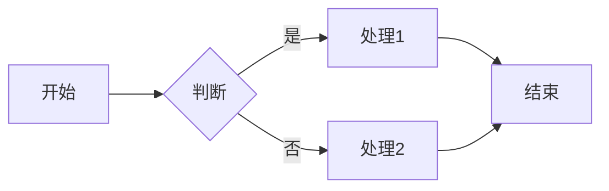

# Mermaid 图表最佳实践

[Mermaid](https://mermaid.js.org/) 是一种易于使用的基于文本的图表生成工具，它允许我们以简单的语法创建各类图表。本指南介绍如何在博客中高效使用 Mermaid 图表。

## 推荐用法

我们的博客支持两种方式使用 Mermaid：

### 1. 使用 Markdown 代码块（适合简单编辑）

````markdown

````

这会自动转换为 HTML 的 `<div class="mermaid">` 元素。

### 2. 直接使用 HTML（推荐方式，可添加标题）

```html
<div class="mermaid">
flowchart LR
    A[开始] --> B{判断}
    B -->|是| C[处理1]
    B -->|否| D[处理2]
    C --> E[结束]
    D --> E
</div>
<p class="mermaid-caption">流程图示例</p>
```

这种方式更灵活，允许添加图表说明。

## 图表类型示例

### 流程图

<div class="mermaid">
flowchart TD
    Start --> Stop
</div>
<p class="mermaid-caption">最简单的流程图</p>

### 序列图

<div class="mermaid">
sequenceDiagram
    Alice->>John: 你好 John, 最近如何?
    John-->>Alice: 很好谢谢!
</div>
<p class="mermaid-caption">简单的序列图</p>

### 甘特图

<div class="mermaid">
gantt
    title 项目进度
    dateFormat  YYYY-MM-DD
    section 调研
    需求分析     :a1, 2025-01-01, 30d
    section 开发
    编码实现     :after a1, 20d
</div>
<p class="mermaid-caption">项目甘特图</p>

### 类图

<div class="mermaid">
classDiagram
    Animal <|-- Duck
    Animal <|-- Fish
    Animal <|-- Zebra
    Animal : +int age
    Animal : +String gender
    Animal: +isMammal()
    Animal: +mate()
    class Duck{
      +String beakColor
      +swim()
      +quack()
    }
    class Fish{
      -int sizeInFeet
      -canEat()
    }
    class Zebra{
      +bool is_wild
      +run()
    }
</div>
<p class="mermaid-caption">面向对象类图</p>

### 状态图

<div class="mermaid">
stateDiagram-v2
    [*] --> 待办
    待办 --> 进行中
    进行中 --> 已完成
    进行中 --> 已暂停
    已暂停 --> 进行中
    已完成 --> [*]
</div>
<p class="mermaid-caption">任务状态图</p>

## 注意事项

1. 图表会根据当前网站主题自动适应浅色/深色模式
2. 复杂图表推荐使用 HTML 方式并添加说明
3. 所有 Mermaid 语法都完全支持，详见[官方文档](https://mermaid.js.org/syntax/flowchart.html)
