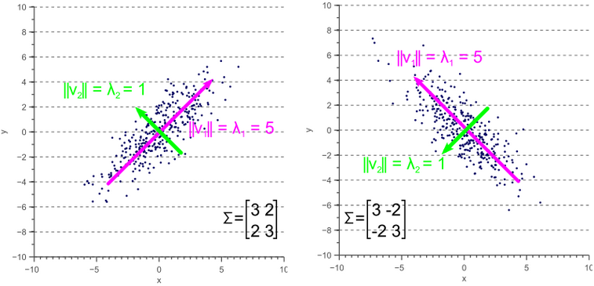
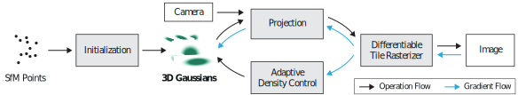
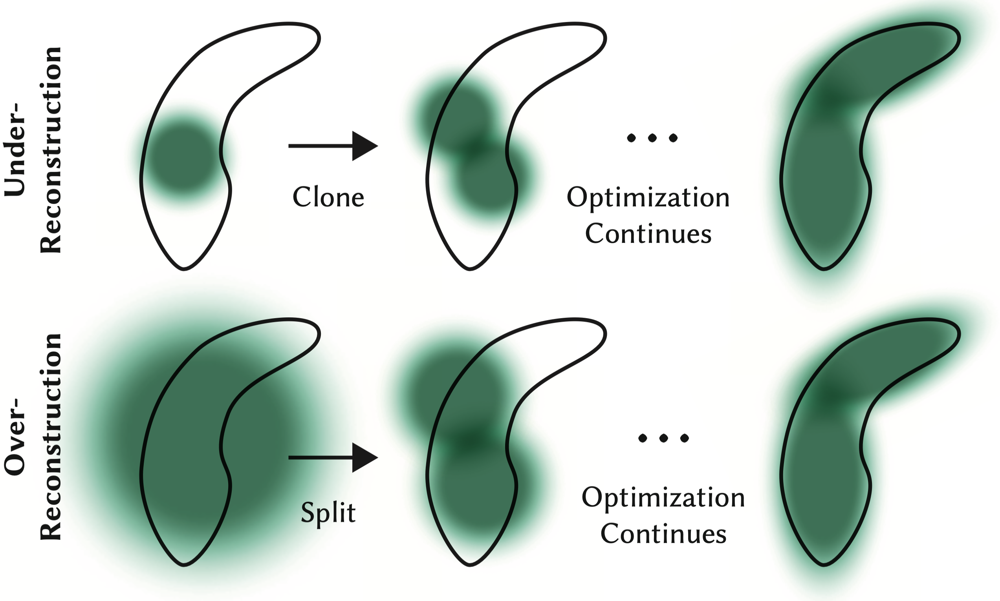

> 3D Gaussian Splatting(3DGS)由2023年论文[3D Gaussian Splatting for Real-Time Radiance Field Rendering](https://arxiv.org/abs/2308.04079)中提出，由于渲染速度快且质量高，迅速超越(NeRF)称为新视角渲染的热点，涌现出大量优秀的后续工作。本篇笔记以论文原文和原作者的教程[^5]为基础，包括简单的渲染代码实现，训练时关键参数的初始化等，不包括模型的训练代码。

## Background
如果不了解图形学以及忘记一些基础知识，这里进行简单的介绍。

### Rasterization
栅格化（Rasterization）是将矢量图形转换为像素点阵的过程，是计算机图形学中的一个基础概念。简单来说，就是把连续的几何图形（如线段、多边形、曲线等）转换成离散的像素点来显示在屏幕上。Gaussian Splatting在最终显示时仍需要将结果投影到离散像素上，这一步可以看作是一种特殊的栅格化过程。

### Splatting
泼贱（Splatting）是一种渲染技术，形象的说是将3D点或体素"泼洒"到2D图像平面的技术。泼贱技术的关键：
- 核函数：每个3D点或者体素都被视为一个局部影响区域，用一个核函数表示，常见的核函数包括：高斯核，EWA（椭圆加权平均）等
- 投影过程：需要将核函数(包括影响范围和强度)投影到图像平面，而不是简单的投影单个点
- 混合(Blending)：多个点对于同一个像素的贡献要正确的混合，可以按照深度对所有的核函数进行排序

### Multivariate Gaussian Distribution
$N$维随机变量$\mathbf{x}=[x_1, x_2, ..., x_N]$服从多元高斯分布，记作$\mathbf{x} \sim \mathcal{N}(\mathbf{\mu}, \mathbf{\Sigma})$，则它的概率密度函数为：

$$
\begin{equation}
  p(\mathbf{x}) = \frac{1}{(2\pi)^{N/2} |\mathbf{\Sigma}|^{1/2}} \exp\left( -\frac{1}{2} (\mathbf{x} - \mathbf{\mu})^\top \mathbf{\Sigma}^{-1} (\mathbf{x} - \mathbf{\mu}) \right)
\end{equation}
$$

其中：$\mathbf{\mu} \in \mathbb{R}^{N}$是均值向量，$\mathbf{\Sigma} \in \mathbb{R}^{N \times N}$是协方差矩阵，$|\mathbf{\Sigma}|$是协方差矩阵行列式值，$\mathbf{\Sigma}^{-1}$为协方差矩阵的逆。
$(\mathbf{x} - \mathbf{\mu})^\top \mathbf{\Sigma}^{-1} (\mathbf{x} - \mathbf{\mu})$称为马氏距离，用于衡量一个点$\mathbb{x}$与一个分布之间的距离，是一个**标量值**。

随机变量$x$和$y$的协方差的计算：$\Sigma(x,y)=E[(x-\mu_{x})(y-\mu_{y})]$，描述两个随机变量之间的相关性，如果协方差为正，则表示两个变量正相关，即同方向变化，如果为负，则负相关，如果为零，则不相关；协方差值的大小没有比较的意义。协方差矩阵就是多个随机变量协方差构成的方阵。

:::note
多元随机变量$\mathbf{x}$的协方差矩阵是$\Sigma$，那么$\mathbf{x}$经过线性变换$\mathbf{A}$后的协方差矩阵是？先说结论： $\Sigma(A\mathbf{x})=A\Sigma(\mathbf{x})A^\top$

我们来推导一下。令$\mathbf{y}=\mathbf{Ax}$，则$\Sigma(\mathbf{y}) = E[(\mathbf{y} - E[\mathbf{y}])(\mathbf{y} - E[\mathbf{y}])^\top]$，由于$E[\mathbf{y}] = E[\mathbf{Ax}] = \mathbf{A}E[\mathbf{x}]$，代入可知$\Sigma(\mathbf{y})=E[(\mathbf{Ax}-\mathbf{A}E[\mathbf{x}])(\mathbf{Ax}-\mathbf{A}E[\mathbf{x}])^\top]$。

由于$\mathbf{A}$是一个常数矩阵，将上面式子中的$\mathbf{A}$提取出来，$\Sigma(\mathbf{y})=E[\mathbf{A}(\mathbf{x}-E[\mathbf{x}])(\mathbf{x}-E[\mathbf{x}])^\top\mathbf{A}^{\top}]=\mathbf{A}\Sigma(\mathbf{x})\mathbf{A}^\top$，证明完毕。
:::

协方差矩阵是**半正定对称矩阵**，即:

$$
\begin{align}
  \Sigma=\Sigma^\top \rightarrow cov(x_i, x_j)&=cov(x_j,x_i) \\
  \mathbf{z}^\top \mathbf{\Sigma} \mathbf{z} \geq 0 ,\quad \forall \mathbf{z} \in \mathbb{R}^N
\end{align}
$$

**协方差矩阵的几何意义**：协方差矩阵的主对角线元素是方差，表示的是分布在特征轴上的离散程度，可以形象的理解是分布的高矮胖瘦；非主对角线元素是协方差，表示的是分布的方向(orientation)或者说旋转。下图[^1]是一个二维多元高斯分布，主对角线元素决定了分布的大小，而非主对角线元素决定了分布的旋转。三维高斯分布是一个椭球。



[^1]: [协方差矩阵的几何解释](https://njuferret.github.io/2019/07/28/2019-07-28_geometric-interpretation-covariance-matrix/)

### Quadratic Form
多元高斯分布的定义中使用了二次型（Quadratic Form），论文中也出现多次二次型形式的矩阵相乘，这里简单介绍。

对于一个对称矩阵$\mathbf{A} \in \mathbb{R}^{N \times N}$和一个**列**向量$\mathbf{z} \in \mathbb{R}^{N}$，二次型的定义如下，二次型的结果为一个**标量**。

$$
Q(\mathbf{z})=\mathbf{z}^\top \mathbf{A} \mathbf{z}
$$

如果见到$\mathbf{z}A\mathbf{z}^\top$，它是什么？有两种可能：1）$\mathbf{z}$是行向量，那么其实和$\mathbf{z}^\top \mathbf{A} \mathbf{z}$是等价的；2）$\mathbf{z}$可能是一个矩阵，那么上面式子只是矩阵相乘了。

### Jacobian Matrix
假设某**向量值函数** $\mathbf{f}: \mathbb{R}^n \rightarrow \mathbb{R}^m$，即从$\mathbf{x} \in \mathbb{R}^n$映射到向量$\mathbf{f(x)}\in \mathbb{R}^m$，其雅可比矩阵是$m\times n$的矩阵

$$
J = \left[ \frac{\partial f}{\partial x_1} \cdots \frac{\partial f}{\partial x_n} \right] = \left[ \begin{array}{cccc}
\frac{\partial f_1}{\partial x_1} & \cdots & \frac{\partial f_1}{\partial x_n} \\
\vdots & \ddots & \vdots \\
\frac{\partial f_m}{\partial x_1} & \cdots & \frac{\partial f_m}{\partial x_n}
\end{array} \right]
$$

**雅可比矩阵描述了向量值函数在某一点附近的局部线性变换**，通俗的说，雅可比矩阵在某可微点的邻域范围内提供了向量值函数的近似**线性**表示(一阶泰勒展开)，可视化理解几何意义参考[这个视频](https://www.youtube.com/watch?v=bohL918kXQk)。在3D Gaussian投影过程中会遇到这个知识点。

雅可比矩阵与一阶泰勒展开。可微分函数$\mathbf{f(x)}$，其在某点$\mathbf{z}$的一阶泰勒展开表示为
$$
\mathbf{f(x)} \approx \mathbf{f(z)} + J(\mathbf{z})(\mathbf{x-z})
$$
其中，$\mathbf{f(z)}$是函数在$\mathbf{z}$处的值，$J(\mathbf{z})$是$\mathbf{z}$处的雅可比矩阵，$\mathbf{x-z}$表示$\mathbf{z}$的邻域内点$\mathbf{x}$与之的差。

另外，向量值函数 $\mathbf{f}(\mathbf{x})=(f_1(\mathbf{x}), f_2(\mathbf{x}), ..., f_m(\mathbf{x}))$是输出值为向量的函数，其输入可以是一个标量或者向量。
举一个例子说明，假设有一个粒子在三维空间中运动，其位置随时间$t$变化，我们可以用一个向量值函数来描述这个粒子的位置：
$$\mathbf{r}(t)=\langle f(t), g(t), h(t) \rangle$$
其中，$f(t), g(t), h(t)$分别是例子在$x$轴，$y$轴和$z$轴上的变化。则$\mathbf{r}(t)$是一个向量值函数，输入是时间$t$，输出是三维的例子位置。

### alpha-blending
$\alpha$-blending又称为透明度混合，用于将两个或多个图像以一定的透明度混合在一起，从而创建出具有半透明效果的图像。
$\alpha$-blending的核心在于通过透明度值（$\alpha$值）来控制图像的混合程度。$\alpha$值的范围是$[0,1]$，其中：
- $0$ 表示完全透明，混合后的图像将完全显示背景图像
- $1$ 表示完全不透明，混合后的图像将完全显示前景图像

例如，对于两个图像层（前景图像$A$和背景图像$B$），混合后的图像$C$可以通过以下公式计算：
$$
C = \alpha A + (1-\alpha)B
$$
其中，图像$A,B,C \in \mathbb{R}^{H\times W \times3}$。可知每个像素值都需要混合，得到的$\alpha$是一个与图像大小相同的矩阵。

## 3D Gaussian Representation

三维空间有很多形式，例如显式的栅格化体素Voxel，或者隐式的Neural Radiance。3D Gaussian也是一种对三维空间的表征，用大量的3D Gaussians来更自由、更紧凑(相对于稠密、规则的Voxel)的表征三维空间。3D Gaussians的参数 ($\mathbf{\mu}$和$\mathbf{\Sigma}$) 构成了模型的**权重参数**之一，将三维场景的信息(通过训练)“压缩”到的模型参数中去(即3DGS模型的权重就是这些3D Gaussians参数)，可以用于新视角生成，也可以有更灵活的用途，甚至是自动驾驶的感知任务[^2]。3D Gaussians的表征也可以使用并行化实现高效的渲染。

[^2]: [GaussianFormer: Scene as Gaussians for Vision-Based 3D Semantic Occupancy Prediction](https://arxiv.org/abs/2405.17429)

具体来说，3D Gaussian表征是一组定义在**世界坐标系下**的参数，包含：三维位置(3D position)，协方差(anisotropic covariance)，不透明度(opacity)和球谐函数(spherical harmonic, SH)：
- 3D位置是三维高斯分布的均值$\mathbf{\mu}$，有3个值
- 协方差是三维高斯分布的$\mathbf{\Sigma}$，可以拆分成主对角线元素$3$个值和表示三维旋转的四元数$4$个值，[后面](#covariance-in-practice)会更详细讲解
- 不透明度(opacity)，是一个标量值，用于$\alpha -$blending
- 球谐函数用来表示辐射神经场的带方向的颜色

## 3D Gaussian Rasterizer
3D Gaussians是定义在世界坐标系下的对三维空间的连续表征，需要进行[栅格化](#rasterization)渲染到离散空间的图片上。这里涉及到3D Gaussian的投影和渲染。

### 3D Covariance Splatting
3D Gaussian的位置(均值$\mathbf{\mu}$)投影到图像平面正常使用投影矩阵即可，但是3D Gaussians是三维空间中的椭球形状如何投影到图像平面，协方差矩阵决定了三维椭球的大小和方向，因此协方差矩阵的投影是关键，论文中使用如下公式近似投影协方差矩阵：
$$
\Sigma'=JW\Sigma W^{\top}J^{\top}
$$
其中，$W$是世界坐标系到相机坐标系的变换矩阵（transformation matrix），而$J$是投影变换(projective  transformation)的雅可比矩阵。

:::tip
一般说投影(projective)矩阵，指的是三维空间中的点到二维图像平面的投影，它可以包括两部分：世界坐标系到相机坐标系变换，以及相机坐标系到图像平面的投影。如果只包含相机坐标系到图像坐标系的投影，也可以称作投影矩阵。
:::

:::tip
我们简单推导下上面协方差投影矩阵的基本原理。假设存在一个线性变换$\mathbf{A}$，空间中的高斯分布$\mathbf{x} \sim \mathcal{N}(\mathbf{\mu}, \mathbf{\Sigma})$经过线性变换$\mathbf{A}$后，新的分布$\mathbf{y} \sim \mathcal{N}(\mathbf{A\mu}, \mathbf{A\Sigma A^\top})$，注意观察新的协方差矩阵与上面协方差投影公式的相似性。
:::

三维空间的点从世界坐标系到相机坐标系的变换矩阵是仿射变换，包含旋转矩阵(线性变换)和平移矩阵，因此可以直接使用针对线性变换的协方差矩阵投影。但是**透视投影变换是非线性的**，不能使用相机内参$\mathbf{K}$直接投影到相机平面，因此使用雅可比矩阵对投影变换进行线性近似。

雅可比矩阵提供某个可微点处的线性近似，哪具体是哪个点呢？实现中使用3D Gaussian的均值(mean)变换到相机坐标系后，进行雅可比矩阵的计算（更详细的推导需要阅读论文[^3]）：
```python
def compute_Jocobian(self, mean3d_N3):
    '''
    Compute the Jacobian of the affine approximation of the projective transformation.
    '''
    t = self.camera.world_to_camera(mean3d_N3)
    l = np.linalg.norm(t, axis=1, keepdims=True).flatten()
    # Compute the jacobian according to (29) from EWA Volume Splatting M.Zwicker et. al (2001)
    jacobian = np.zeros((t.shape[0], 3, 3))
    jacobian[:, 0, 0] = 1/t[:, 2]
    jacobian[:, 0, 2] = -t[:, 0]/t[:, 2]**2
    jacobian[:, 1, 1] = 1/t[:, 2]
    jacobian[:, 1, 2] = -t[:, 1]/t[:, 2]**2
    jacobian[:, 2, 0] = t[:, 0]/l
    jacobian[:, 2, 1] = t[:, 1]/l
    jacobian[:, 2, 2] = t[:, 2]/l

    return jacobian
```
[^3]: [Surface Splatting](https://dl.acm.org/doi/10.1145/383259.383300)

实际实现使用的是下面的公式：
$$
\Sigma_{2D}=JR\Sigma_{3D}R^{\top}J^{\top}
$$
其中，$R$是世界坐标系到相机坐标系面的旋转矩阵。

:::tip
为什么从世界坐标系到图像平面的透视变换投影矩阵不是线性变换？投影矩阵如下：
$$
\begin{bmatrix} \mu \\ \nu \\ 1 \\ \end{bmatrix} = \frac{1}{Z_c}K \begin{bmatrix} X_c \\ Y_c \\ Z_c \\ \end{bmatrix}
$$
线性变换对**加法**和**数乘法封闭**，投影矩阵中引入了除法，使得**投影矩阵是非线性变换**。
:::

:::note
为什么投影矩阵实际中只有旋转部分没有平移部分？从[多元高斯分布经过线性变换后的协方差矩阵推导](#multivariate-gaussian-distribution)可知，平移对于协方差没有影响。
:::

### Covariance in practice
协方差矩阵的重要性质是对称矩阵和半正定，如果协方差矩阵作为模型参数进行梯度更新，那么很容易不满足协方差矩阵的性质。因此实际中，依靠协方差矩阵的几何意义，使用更直观的方式来近似表示协方差矩阵。

由于协方差矩阵的几何意义中对角线元素代表方差，即三维椭球大小（高矮胖瘦），非对角线元素代表旋转，因此将协方差矩阵拆分为表示大小的对角矩阵$S$和表示旋转的旋转矩阵$R$:
$$
\Sigma=RSS^\top R^\top
$$
实现中，使用一个$3$维向量$s$表示对角矩阵的元素，使用$4$维向量$q$表示四元数，即$7$个值表示协方差矩阵。

:::tip
为什么分解成$\Sigma=RSS^\top R^\top$? $RS$行不行？$SR$行不行？

因为协方差矩阵是半正定的，因此$\Sigma=RSS^\top R^\top$(有点像二次型)的形式相当于平方，可以保证半正定。

首先，$RS$相当于先scale在旋转，而$SR$相当于先旋转再scale，当scale的所有主对角线元素相同，即三维高斯分布的形状是一个圆球形时，旋转没有意义，两者是相同的。如果对角矩阵$S$主对角线不相同，两者的结果不相同。这里可以参考一篇[博客](https://winka9587.github.io/posts/3dg_cov3d/)。
:::
### Rendering
3DGS使用$\alpha$-blending来近似体积渲染(volumetric rendering)公式:
$$
C(x) = \sum_{i \in \mathcal{N}}c_{i}\alpha_{i}(x)T_i(x)
$$
其中，$i$是Gaussian的下标，$c_i$是该Gaussian的颜色，透明度$\alpha_{i}=(1-exp(-\sigma_i\delta_i))$，其中$\sigma$表示粒子密度，$\delta_i$是光线(ray)上的一段距离；$T_i$被称为透光率(Transmittance):$T_i(x) = \prod_{j=1}^{i-1}(1-\alpha_{j}(x))$，即通过从$j=1$到前一个$i-1$连乘$1-\alpha$得到。

:::note
到这里你可能有些乱，3DGS参数中是不透明度opacity，这里是透明度$\alpha$和复杂的定义，以及又出现了透光率Transmittance。

首先，opacity和$\alpha$在含义上是相同的，$\alpha$是前景颜色的控制量，即当前3D Gaussian颜色对像素的贡献，和不透明度的含义是一致的。

$\alpha$的复杂定义源于透光率Transmittance的物理意义。透光率定义为光线穿过微小圆柱体内某粒子群的出射光线强度与入射光线强度的比值：
$$
T = \frac{I_{out}}{I_{in}} = exp(-\int_{a}^{b} \sigma(t) d(t))
$$
透光率Transmittance表示光线穿过某一区域的**透明度**(和$\alpha$表示的含义是相反的)，透光率$T$越大，表示出射光线基本没有衰减，进而表示这个区域的粒子密度很小，即透明度越高，如果为$0$，则说明完全不透光，即不透明。
:::

**如何计算$\alpha$?**，原文中的表述是：$\alpha$ is given by evaluating a 2D Gaussian with covariance $\Sigma_{2D}$ multiplied with a learned per-point opacity。翻译成代码更好理解：
```python
def _compute_alpha(self, opacity, xmean2d_20, cov2d_22):
    x_HW2 = self.camera.grids # 图像像素中心点
    d_HW2 = x_HW2-xmean2d_20[None, None,...] # 图像像素中心点与该gaussian位置的距离
    alpha_1HW = opacity[None, None, ...] * np.exp(-0.5 * d_HW2[..., None, :] @ np.linalg.inv(cov2d_22) @ d_HW2[..., None]).squeeze()
    return alpha_1HW
```
··
:::important
如果对$\alpha$-blending的公式依然有很多疑问，需要看体积渲染(volumetric rendering)的理论推导部分（数学公式偏多，可以试着推导一下），推荐下面两个材料：
- [基础知识-体渲染 (Volume Rendering)](https://zhuanlan.zhihu.com/p/639892534)
- [Volume Rendering](https://www.scratchapixel.com/lessons/3d-basic-rendering/volume-rendering-for-developers/volume-rendering-summary-equations.html)，上面中文版的英文来源
:::

## Optimization

上图是3DGS的整体流程。首先，论文中从SfM(Structure from Motion)获得三维空间中稀疏的点云作为3D Gaussian的均值（即位置）初始化，然后通过相机的内外参[投影](#3d-covariance-splatting)到图像平面，并进行[渲染](#rendering)，使用该相机的图片作为真值，以及$\mathcal{L_1}$和$D-SSIM$作为损失函数，并反向梯度更新3D Gaussian的参数。3DGS属于可微分渲染。
:::tip
可微分渲染(**differentiable** rendering)指的是用于渲染的参数是模型梯度更新的参数，3DGS属于可微分渲染。
:::

**Adaptive Control of Gaussians**使得优化过程中可以增加新的Gaussian或者删除某些Gaussian，这个优化让我有些吃惊训练过程还可以**动态的增删模型参数**：经过warp-up训练一段后，每100增加(densify)新的Gaussian，并删掉基本透明的Gaussian，即$\alpha$小于一个阈值$\epsilon_{\alpha}$。

增加Gaussian有两种情况，如下图：如果某个区域缺少Gaussian进行渲染，认为是欠重建(Under-Reconstruction)，就复制一份Gaussian；如果一个Gaussian覆盖的区域过大，被认为是过重建(Over-Reconstruction)，就需要把这个Gaussian给一分为二。**使用什么作为证据判断上述情况？**论文通过训练中的观察，经验性的认为如果位置的梯度过大(positional gradient)，这个高斯对应的渲染区域可能没有被重建的很好：即平均的位置梯度值大小大于阈值$\tau_{pos}=0.0002$时,当然，这些都是从训练中得到的经验值:
- 如果这个Gaussian很小(协方差很小)，被认为是欠重建，于是从该Gaussian直接克隆一个新的Gaussian，但是新的位置使用位置梯度更新。
- 如果这个Gaussian很大(协方差很大)，被认为值过重建，于是把该Gaussian一分为二：从原3D Gaussian中采样作为新的位置，并且新的协方差是原3D Gaussian协方差除以$\phi=1.6$。

还有很多优化细节，可以阅读论文原文更详细的了解。



:::important
从这里的优化技巧可以看出来3DGS论文在训练成功是不容易的：首先，SfM得到的点是比较稀疏的，有些区域比较密，有些区域可能是空的，并且包含噪音；其次，有些Gaussian的位置需要较大的移动才行，这导致优化很容易陷入局部极值点，pixelSplat[^4]对次做了改进。
[^4]: [pixelSplat: 3D Gaussian Splats from Image Pairs for Scalable Generalizable 3D Reconstruction](https://arxiv.org/abs/2312.12337)
:::

## Simple Rasterizer Implementation
本文参考作者的教程[^5]进行了简单的实现，主要包括：`Gaussian3D`, `Camera`和`GaussianRaterizer`三个类，读者可以自行创建一些3D Gaussian尝试：
```python
def fake_gaussians(num=3):
    red = np.array([1., 0., 0.])
    green = np.array([0., 1., 0.])
    blue = np.array([0., 0., 1.])
    colors = [red, green, blue]
    gaussians = []
    for i in range(num):
        g = Gaussian3D.create_from(
            mean=np.array([(i + 1)**2, 0, 0]),
            opacity=np.array([0.7]),
            covariance=np.array([*np.random.rand(3), 1, 0, 0, 0]),
            color=colors[i%3]
        )
        gaussians.append(g)
    
    return gaussians
```
<details>
<summary><code>Gaussian3D</code></summary>

```python
class Gaussian3D:
    def __init__(self) -> None:
        self.init_default()

    def init_default(self):
        self._mean = np.zeros(3,)[..., None]
        self._opacity = np.zeros(1,)[..., None]
        scale = [1.0, 1.0, 1.0]
        quaternion = [1.0, 0.0, 0.0, 0.0]
        self._covariance = np.array(scale.extend(quaternion))[..., None]
        self._color = np.array([0., 0., 0.])[..., None] # TODO: use spher harmonic to represent color
    
    def set_mean(self, mean):
        self._mean = mean

    def get_mean(self):
        return self._mean

    def set_opacity(self, opacity):
        self._opacity = opacity

    def get_opacity(self):
        return self._opacity

    def set_covariance(self, covariance):
        self._covariance = covariance

    def get_covariance(self):
        return self._covariance

    def set_color(self, color):
        self._color = color

    def get_color(self):
        return self._color

    @classmethod
    def create_from(cls, mean, opacity, covariance, color):
        instance = cls()
        instance.set_mean(mean)
        instance.set_opacity(opacity)
        instance.set_covariance(covariance)
        instance.set_color(color)
        return instance

    def covariance_matrix(self):
        '''
        3D Gaussian covariance matrix could be decomposed into 2 matrix
        scale (diag matrix) and rotation matrix (sym matrix)
        $\Sigma = RSS^TR^T$
        ''' 
        scale, quaternion = self._covariance[:3], self._covariance[3:]
        scale_matrix = np.zeros((3,3))
        scale_matrix[0,0] = scale[0]
        scale_matrix[1,1] = scale[1]
        scale_matrix[2,2] = scale[2]
        rotation_matrix = self._quaternion_to_rotation_matrix(quaternion)
        matrix_33 = rotation_matrix @ scale_matrix
        
        return matrix_33 @ matrix_33.T

    def _quaternion_to_rotation_matrix(self, q):
        w, x, y, z = q
        R = np.array([
            [1 - 2*y**2 - 2*z**2, 2*x*y - 2*z*w, 2*x*z + 2*y*w],
            [2*x*y + 2*z*w, 1 - 2*x**2 - 2*z**2, 2*y*z - 2*x*w],
            [2*x*z - 2*y*w, 2*y*z + 2*x*w, 1 - 2*x**2 - 2*y**2]
        ])
        return R
```
</details>

<details>
<summary><code>Camera</code></summary>

```python
class Camera:
    def __init__(self, intrinsics, extrinsics, image_size_hw, normalize_grid=True) -> None:
        self.intrinsics_33 = intrinsics
        self.extrinsics_44 = extrinsics
        self.image_size_hw = image_size_hw
        self.normalize_grid = normalize_grid # return image grid normalized to [-1, 1]
        self.grids = self._build_grid(self.normalize_grid)
        self._image = np.zeros((3, *self.image_size_hw))

    def set_image(self, image):
        self._image = image
    
    def get_image(self):
        return self._image
    
    def _build_grid(self, normalize_grid=True):
        h, w = self.image_size_hw
        offset = 0.5
        w_range = offset + np.linspace(0, w-1, w)
        h_range = offset + np.linspace(0, h-1, h)
        if normalize_grid:
            half_w, half_h = w/2, h/2
            w_range = (w_range - half_w) / half_w
            h_range = (h_range - half_h) / half_h
        hh, ww = np.meshgrid(h_range, w_range, indexing='ij')
        grid_HW2 = np.stack((hh, ww), axis=-1) 
        return grid_HW2
    
    def world_to_camera(self, points_world_N4):
        # project points in world coordinate to camera coordinate using extrinsics
        if points_world_N4.shape[1] == 3:
            ones = np.ones((points_world_N4.shape[0], 1))
            points_world_N4 = np.hstack((points_world_N4, ones))
        points_camera_N3 = (self.extrinsics_44 @ points_world_N4.T)[:3, :].T
        
        return points_camera_N3
    
    @property
    def world_to_camera_matrix(self):
        return self.extrinsics_44

    def camera_to_image(self, points_camera_N3):
        points_image_3N = self.intrinsics_33 @ points_camera_N3.T
        points_image_N2 = (points_image_3N[:2, :] / points_image_3N[2, :]).T
        return points_image_N2

    @property    
    def camera_to_image_matrix(self):
        return self.intrinsics_33

    def world_to_image(self, points_world_N4):
        points_image_N2 = self.camera_to_image(self.world_to_camera(points_world_N4))
        if self.normalize_grid:
            h, w = self.image_size_hw
            half_w, half_h = w/2, h/2
            points_image_N2[:, 0] = (points_image_N2[:, 0] - half_w) / half_w
            points_image_N2[:, 1] = (points_image_N2[:, 1] - half_h) / half_h
        return points_image_N2
    
    @property
    def world_to_image_matrix(self):
        intrinsics_44 = np.eye(4)
        intrinsics_44[:3, :3] = self.intrinsics_33

        projection_matrix = intrinsics_44 @ self.extrinsics_44
        
        return projection_matrix
```
</details>

<details>
<summary><code>GaussianRaterizer</code></summary>

```python
class GaussianRaterizer:
    def __init__(self, camera: Camera) -> None:
        self.camera = camera
    
    def _compute_alpha(self, opacity, xmean2d_20, cov2d_22):
        x_HW2 = self.camera.grids
        d_HW2 = x_HW2-xmean2d_20[None, None,...]
        alpha_1HW = opacity[None, None, ...] * np.exp(-0.5 * d_HW2[..., None, :] @ np.linalg.inv(cov2d_22) @ d_HW2[..., None]).squeeze()
        return alpha_1HW

    def alpha_blending_render(self, gaussians: List[Gaussian3D]):
        # sort gaussians by depth, i.e. z
        gaussians = sorted(gaussians, key=lambda x : x.get_mean()[2])
        cov3d_N33 = np.vstack([g.covariance_matrix()[None, ...] for g in gaussians])
        mean3d_N3 = np.vstack([g.get_mean() for g in gaussians])
        mean2d_N2 = self.camera.world_to_image(mean3d_N3)
        cov2d_N22 = self.to_covariance_2d(mean3d_N3, cov3d_N33)[:, :2, :2]
        colors_N0 = np.vstack([g.get_color() for g in gaussians])
        opacity_N0 = np.vstack([g.get_opacity() for g in gaussians])

        image = self.camera.get_image() # empty image
        T = np.ones((1, *self.camera.image_size_hw))
        for mean_2d, cov_2d, color, opacity in zip(mean2d_N2, cov2d_N22, colors_N0, opacity_N0):
            alpha = self._compute_alpha(opacity, mean_2d, cov_2d)
            image += T * alpha * color[..., None, None]
            T = T*(1 - alpha)
        
        self.camera.set_image(image)

        return image

    def to_covariance_2d(self, mean3d_N3, cov3d_N33):
        '''
        Project covariance 3d to 2d:
        $\Sigma_{2D} = JW \Sigma_{3D} W^TJ^T$
        J is Jacobian of the affine approximation of the projective transformation.
        '''
        
        jacobian = self.compute_Jocobian(mean3d_N3)
        R = self.camera.world_to_camera_matrix[:3, :3]
        return jacobian @ R[None, ...] @ cov3d_N33 @ R.T[None, ...] @ jacobian.swapaxes(1, 2)

    def compute_Jocobian(self, mean3d_N3):
        '''
        Compute the Jacobian of the affine approximation of the projective transformation.
        '''
        t = self.camera.world_to_camera(mean3d_N3)
        l = np.linalg.norm(t, axis=1, keepdims=True).flatten()
        # Compute the jacobian according to (29) from EWA Volume Splatting M.Zwicker et. al (2001)
        jacobian = np.zeros((t.shape[0], 3, 3))
        jacobian[:, 0, 0] = 1/t[:, 2]
        jacobian[:, 0, 2] = -t[:, 0]/t[:, 2]**2
        jacobian[:, 1, 1] = 1/t[:, 2]
        jacobian[:, 1, 2] = -t[:, 1]/t[:, 2]**2
        jacobian[:, 2, 0] = t[:, 0]/l
        jacobian[:, 2, 1] = t[:, 1]/l
        jacobian[:, 2, 2] = t[:, 2]/l

        return jacobian
```
</details>

[^5]: [3DGS Lab Exercise](https://3dgstutorial.github.io/3dv_part1.pdf)

## Further
3DGS还有很多内容本文没有覆盖，可以留作未来的可以更新的内容，或由读者进一步探索：
- 3D Gaussian的训练代码，由于论文代码仓库这部分包括一些CUDA算子显式地对梯度进行操作，超出了我目前的能力
- 3D Gaussian所有参数的初始化，也有一些有意思的地方
- 论文第6章Tile-based Rasterizer，即分片的光栅化方法，也是3DGS高效渲染的部分