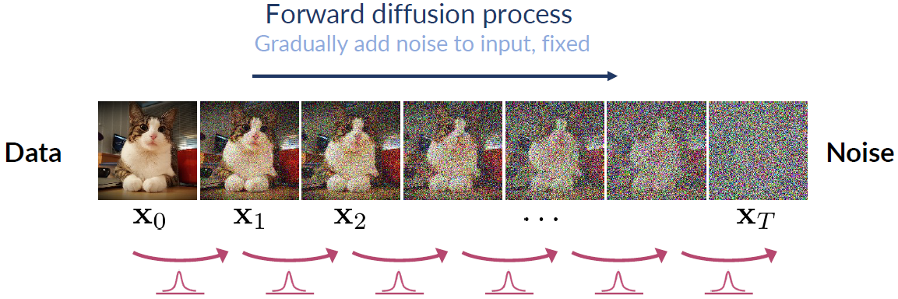
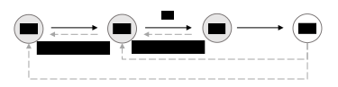
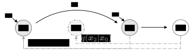

> Diffusion Model（扩散模型）是目前图像、视频生成模型的基础，其核心思想是通过逐步添加噪声（正向扩散）和逐步去噪（反向生成）的过程，将数据从原始分布逐步转换为噪声分布，再通过学习逆过程逐步去除噪音生成高质量样本。

## Diffusion Model
Diffusion model早在2015年论文[^1]中提出，但是在2020年Denoising Diffusion Probabilistic Model, DDPM[^2]工作中得到显著改进，可以生成高质量图像。扩散模型被人熟知包含正向加噪过程和反向去噪过程。

[^1]: [Deep Unsupervised Learning using Nonequilibrium Thermodynamics](https://arxiv.org/abs/1503.03585)
[^2]: [Denoising Diffusion Probabilistic Model](https://arxiv.org/abs/2006.11239)

### Diffusion
> 所谓“噪音”指的是标准正态分布。

**正向扩散过程：把复杂数据“拆解”成简单的噪声**
正向过程的核心任务是逐步向数据中添加噪声，直到它变成完全随机的高斯噪声。这一步看似简单，但它的意义非常深刻。真实世界的数据分布往往是高度复杂的，比如图像、语音、文本，它们的特征空间可能有无数个维度，分布形态也极其不规则。直接建模这样的分布几乎是不可能。但通过正向过程，我们可以把这种复杂性“分解”掉。每一步只添加一点点噪声，逐步掩盖数据的细节，最终让数据完全服从高斯分布，这样一来，原本复杂的分布就被转化成一个简单的高斯分布，学习任务的难度大大降低。这一步的设计，实际上是为了让模型有一个明确的起点和终点，避免在复杂分布中迷失方向。

**反向扩散过程：从噪声中“重建”数据的本质**
反向过程要从完全随机的噪声中逐步还原出原始数据，这一步是整个Diffusion Model的核心，它通过训练神经网络，学习如何在每一步中去除噪声，最终将噪声还原为有意义的数据样本。反向过程并不是简单地“撤销”正向过程，而是通过学习噪声的逆操作，逐步还原数据的本质特征。每一步的去噪操作都相当于在问：“如果我现在有一个带噪声的样本，它最可能的前一步是什么样子？”通过这种方式，模型能够逐步剥离噪声，最终还原出原始数据。这种逐步逼近的方式，不仅让学习任务变得可控，还让模型能够捕捉到数据的深层结构。

这两个过程的存在，实际上是为了应对生成模型中的一个核心难题：**如何在复杂的分布中采样**。生成模型，比如GAN，直接从随机噪声中生成数据，但这种方式容易导致模式崩塌（mode collapse），即生成的样本多样性不足。而Denoising Diffusion Model通过正向和反向过程，把生成任务分解成多个小步骤，每一步都只学习一个简单的任务——添加或去除噪声。这种分步学习的方式，不仅提高了模型的稳定性，还显著提升了生成样本的质量和多样性。

### Forward Diffusion
我们令$\mathbf{x_0}$为真实数据图像，从真实的数据分布$\mathbb{q(x)}$从采样，是正向过程初始时的数据，从$0$到$T$步，逐渐加入微小的噪音，经过足够多的步数，最终$\mathbf{x_T}$为从标准高斯分布中随机采样出来的(噪音)数据，即$\mathbf{x_T} \sim \mathcal{N}(\mathbf{0},\mathbf{I})$。正向过程可以使用下图（来自[^2]）表示:

正向扩散过程定义为马尔科夫过程（即当前步$t$只与上一步$t-1$有关）：
$$
\begin{equation}
    q(\mathbf{x}_{1:T} \vert \mathbf{x}_0) = \prod^T_{t=1} q(\mathbf{x}_t \vert \mathbf{x}_{t-1})
\end{equation}
$$
其中每一步加的噪音$q(\mathbf{x}_t \vert \mathbf{x}_{t-1})$服从正态分布：
$$
\begin{equation}
   q(\mathbf{x}_t \vert \mathbf{x}_{t-1}) = \mathcal{N}(\mathbf{x}_t; \sqrt{1 - \beta_t} \mathbf{x}_{t-1}, \beta_t\mathbf{I}) 
\end{equation}
$$

利用重参数化(Reparameterization Trick)从$\mathcal{N}(\mathbf{x}_t; \sqrt{1 - \beta_t} \mathbf{x}_{t-1}, \beta_t\mathbf{I})$进行采样：
$$
\begin{equation}
    \mathbf{x_t} = \sqrt{1-\beta_t}\mathbf{x_{t-1}} + \sqrt{\beta_t}\epsilon_{t}, \quad \epsilon_t \sim \mathcal{N}(\mathbf{0},\mathbf{I})
\end{equation}
$$

:::tip
**正态分布的线性变换性质：可以将标准正态分布转换为任意均值和方差的正态分布** 若随机变量$Z\sim \mathcal{N}(0,1)$，则对任意常数$\mu$和$\sigma$，随机变量$X=\mu + \sigma Z$，服从$X \sim \mathcal{N}(\mu, \sigma^2)$

**重参数化(Reparameterization Trick)技巧是一种将随机变量的采样过程分解为确定性部分和随机噪声部分的方法** 
$$
X = \underbrace{\mu}_{确定性参数} + \sigma \underbrace{\epsilon}_{随机噪声}, \quad \epsilon \sim \mathcal{N}(0,1)
$$
重参数化计算得到的随机变量$x_t$依然服从$\mathcal{N}(\mu, \sigma^2)$
:::

#### Parameterization of beta
**$\beta_t$是什么？**

$\beta_t$对前向扩散过程中对噪音进行控制的参数，在DDPM[^2]论文中，$\beta_t$是从$\beta_1=10^{-4}$到$\beta_T=0.02$线性增加的常量，$T=1000$。对比归一化$[-1,1]$之后的像素值，$\beta_t$是很小的值，即每一步添加的噪音是很小的。

**为什么使用$\sqrt{\beta_t}$对方差进行缩放？**

这会涉及到两种不同的控制方差的方法：`Variance Exploding` vs `Variance Preserving`。
- `Variance Exploding`方差爆炸:
$$
x_t=x_{t-1} + \sqrt \beta_t \epsilon
$$

假设初始方差是$Var(x_0)=I$，方差的变化：$Var(x_1)=Var(x_0)+\beta_1 I=I+\beta_1 I$，递推下去$Var(x_T)=Var(x_0)+\sum_{t=1}^{T}\beta_t$，
即经过$T$步之后，方差$I+\sum_{t=1}^{T}\beta_t$会随着扩散步数$T$增大（“爆炸”），训练和采样都会变得不稳定。

- `Variance Preserving`方差保持
DDPM采用的是这个控制方差的方法通过缩放避免方差爆炸：
$$
x_t=\sqrt \alpha_t x_{t-1} + \sqrt \beta_t \epsilon, \quad \alpha_t + \beta_t=1
$$
方差的变化：$Var(x_1)=\alpha_1 Var(x_0) + \beta_1 I = I$，递推下去，$Var(x_T)$保持不变，所以称为方差保持。

**重写采样公式**

我们试着展开上面的采样公式，展开之前，我们先对变量做一些变换，有助于公式的推导，令$\alpha_t=1-\beta_t$：
$$
\begin{align}
    \mathbf{x_t} &= \sqrt{\alpha_t}\mathbf{x_{t-1}} + \sqrt{1-\alpha_t}\epsilon_{t} \\
    &=\sqrt{\alpha_t}( \sqrt{\alpha_{t-1}}\mathbf{x_{t-2}} + \sqrt{1-\alpha_{t-1}}\epsilon_{t-1}) + \sqrt{1-\alpha_t}\epsilon_{t} \\
    &=\sqrt{\alpha_t\alpha_{t-1}}\mathbf{x_{t-2}} + \underbrace{ \sqrt{\alpha_t(1-\alpha_{t-1})}\epsilon_{t-1} + \sqrt{1-\alpha_t}\epsilon_{t}}_{\text{i.i.d gaussian noise}}
\end{align}
$$
如果继续展开更多步，噪声项会变得越来越多，因为都是独立同分布的噪声项，由于正态分布是可以叠加的，可以对噪声项进行简化。注意到$\sqrt{\alpha_t(1-\alpha_{t-1})}\epsilon_{t-1} \sim \mathcal{N}(0,\alpha_t(1-\alpha_{t-1})\mathbf{I})$，因为$\epsilon_{t-1} \sim \mathcal{N}(\mathbf{0},\mathbf{I})$，对它进行相乘，不改变均值，但是会改变方差。同理，$\sqrt{1-\alpha_t}\epsilon_{t} \sim \mathcal{N}(0,(1-\alpha_{t})\mathbf{I})$，两个噪声项之和也服从高斯分布，新的分布是$\mathcal{N}(0,\alpha_t(1-\alpha_{t-1})+(1-\alpha_{t})\mathbf{I})=\mathcal{N}(\mathbf{0}, (1-\alpha_t\alpha_{t-1})\mathbf{I})$，两个噪音项的和相当于从新的分布采样，令$\bar{\epsilon}_{t-2}$是合并后从$\mathcal{N}(\mathbf{0},\mathbf{I})$的采样值，再经过缩放：
$$
\begin{equation}
   \sqrt{\alpha_t(1-\alpha_{t-1})}\epsilon_{t-1} + \sqrt{1-\alpha_t}\epsilon_{t}=\sqrt{1-\alpha_t\alpha_{t-1}}\bar{\epsilon}_{t-2} 
\end{equation}
$$
则，
$$
\begin{align}
    \mathbf{x_t} &= \sqrt{\alpha_t}\mathbf{x_{t-1}} + \sqrt{1-\alpha_t}\epsilon_{t} \\
    &= \sqrt{\alpha_t\alpha_{t-1}}\mathbf{x_{t-2}} + \sqrt{1-\alpha_t\alpha_{t-1}}\bar{\epsilon}_{t-2}
\end{align}
$$
我们可以一路推导到$\mathbf{x_0}$：
$$
\begin{align}
\mathbf{x}_t 
&= \sqrt{\bar{\alpha}_t}\mathbf{x}_0 + \sqrt{1 - \bar{\alpha}_t}\boldsymbol{\epsilon}, \quad \bar{\alpha}_t=\prod^t_{s=1}\alpha_s
\end{align}
$$

这个递推公式等价于从下面的分布进行采样：
$$
q(\mathbf{x}_t \vert \mathbf{x}_0) = \mathcal{N}(\mathbf{x}_t; \sqrt{\bar{\alpha}_t} \mathbf{x}_0, (1 - \bar{\alpha}_t)\mathbf{I})
$$
然后，我们再换回来$\beta_t=1-\alpha_t$:
$$
q(\mathbf{x}_t \vert \mathbf{x}_0) = \mathcal{N}(\mathbf{x}_t; \sqrt{1-\bar{\beta}_t} \mathbf{x}_0, \bar{\beta}_t\mathbf{I})
$$

:::tip
为什么经过$\mathbf{T}$步骤的逐渐加噪音，$\mathbf{x_T}$最后会服从标准正态分布？

使用中心极限定理可以比较简单的说明。中心极限定理（central limit theorem/CLT）是概率论核心定理之一。假设有<code>独立同分布(i.i.d)</code>的随机变量$\mathbf{X_1, X_2,...,X_n}$，总体均值为$\mu$，方差为$\sigma^2$，当样本量$n$足够大的时候，样本均值$\bar{\mathbf{X}}=\frac{1}{n}\sum_{i=1}^{n}\mathbf{X_i}$趋近于标准正态分布
$$
\frac{\bar{\mathbf{X}}-\mu}{\sigma / \sqrt{n}}
\sim
\mathcal{N}(\mathbf{0},\mathbf{I})
$$
正向扩散过程每一步添加的随机变量都是独立同分布与标准正态分布，因此，最后加和得到的$x_T$无限趋近于标准正态分布。
:::

[^2]: [SIGGRAPH 2023 Course on Diffusion Models](https://dl.acm.org/doi/10.1145/3587423.3595503)

### Reverse Diffusion
> 注意这一节中的大量公式可能会比较绕: 正向过程$q(\mathbf{x}_{1:T} \vert \mathbf{x}_0) = \prod^T_{t=1} q(\mathbf{x}_t \vert \mathbf{x}_{t-1})$，真实的逆向过程$q(\mathbf{x}_{t-1} \vert \mathbf{x}_t)$，近似逆向过程的分布$\mathbf{p}(\mathbf{x}_T)\prod_{t=1}^{T}\mathbf{p}_{\theta}(\mathbf{x}_{t-1} \vert \mathbf{x}_t)$

逆向扩散过程，即**生成过程**，逐步从噪音(标准正态分布)$\mathbf{x}_T$中去噪，最终得到图像$\mathbf{x}_{0}$。上一节，得到了正向扩散$q(\mathbf{x}_t \vert \mathbf{x}_{t-1})$，并且它服从高斯分布$\mathcal{N}(\mathbf{x}_t; \sqrt{1 - \beta_t} \mathbf{x}_{t-1}, \beta_t\mathbf{I})$，那么真实的逆向扩散(论文中也称为前向过程的后验分布forward process posteriors)应是$q(\mathbf{x}_{t-1} \vert \mathbf{x}_t)$，这个分布根据DDPM论文中的叙述，当$\beta_t$足够小，同样是服从高斯分布。但是，真实的逆向扩散$q(\mathbf{x}_{t-1} \vert \mathbf{x}_t)$难以计算，于是使用模型来近似逆向扩散，设模型为$\mathbf{p}_{\theta}(\mathbf{x}_{t-1} \vert \mathbf{x}_t)$。

逆向扩散过程同样使用马尔可夫过程来描述：
$$
\begin{equation}
    \mathbf{p}_{\theta}(\mathbf{x}_{0:T})=\mathbf{p}(\mathbf{x}_T)\prod_{t=1}^{T}\mathbf{p}_{\theta}(\mathbf{x}_{t-1}|\mathbf{x}_t)
\end{equation}
$$
其中，$\theta$是DDPM模型的权重参数。

由于真实的逆向扩散$q(\mathbf{x}_{t-1} \vert \mathbf{x}_t)$服从高斯分布，因此**可以假设模型近似的逆向扩散$p_\theta(\mathbf{x}_{t-1} \vert \mathbf{x}_t)$同样服从高斯分布**：
$$
p_\theta(\mathbf{x}_{t-1} \vert \mathbf{x}_t) \sim \mathcal{N}(\mathbf{x}_{t-1}; \boldsymbol{\mu}_\theta(\mathbf{x}_t, t), \boldsymbol{\Sigma}_\theta(\mathbf{x}_t, t))
$$

> [TODO] 为什么：如果正向过程$q(\mathbf{x}_t \vert \mathbf{x}_{t-1}) = \mathcal{N}(\mathbf{x}_t; \sqrt{1 - \beta_t} \mathbf{x}_{t-1}, \beta_t\mathbf{I})$中的$\beta_t$足够小，那么逆向扩散$q(\mathbf{x}_{t-1} \vert \mathbf{x}_t)$也是高斯分布：$q(\mathbf{x}_{t-1} \vert \mathbf{x}_t) = \mathcal{N}(\mathbf{x}_{t-1}; \tilde{\boldsymbol{\mu}}(\mathbf{x}_t), \tilde{\beta}_t \mathbf{I})$

:::note
多变量联合概率拆分：$P(A,B,C)=P(A|B,C)P(B|C)P(C)$

由于逆向扩散过程也是马尔科夫过程，所以$p(x_1, x_2, \dots, x_T)=p(x_1|x_2, \dots, x_T)\cdots=p(x_1|x_2)\cdots$，因为$x_1$只与$x_2$有关，和其余过程无关。
:::

### Objective

Diffusion模型优化目标的结论是比较简单的，但是公式的推导和理解是需要静下心来慢慢看懂、推导的！

#### Variational Lower Bound
与[VAE](https://www.s7ev3n.space/posts/vae/)试图一步生成图像不同，逆向过程逐步去除噪音，可以更好的近似真实的数据分布$\mathbf{p(x_0)}$，生成质量非常高的图片。也可以把逆向扩散过程理解成[马尔科夫分层自编码器(Markovian Hierarchical Variational Autoencoder,MHVAE)](https://www.zhangzhenhu.com/aigc/)，此时逆向过程中的$\mathbf{x_1, x_2, \dots, x_{T-1}}$都可以看成是隐变量。

**生成模型的最终目标都是学习到真实数据的分布，即$\mathbf{p(x_0)}$**，从而可以从其中采样生成非常真实的图像。由于无法对真实数据的分布进行建模，VAE中引入了隐变量$z$，并通过对联合概率的边缘化$\mathbf{p}(x) = \int_z \mathbf{p}(x,z) dz$建模分布，并推导出$\log p(x)$的变分下界(ELBO)。逆向扩散过程也一样，只是存在更多的中间隐变量，与VAE的ELBO是一致的(详细推导见[VAE](https://www.s7ev3n.space/posts/vae/)博文中):
$$
\begin{align}
    \log\mathbf{p(x_0)} &= \log \int_{x_1} \int_{x_2} \cdots \int_{x_T} p(x_0, x_1, \dots, x_T) dx_1 dx_2 \cdots dx_T \\
    &=\log\int_{x_{1:T}} p(x_T)\prod_{t=1}^{T}p_{\theta}(x_{t-1}|x_t) d_{x_{1:T}} \\
    &=\log\int_{x_{1:T}}p_{\theta}(x_{0:T}) d_{x_{1:T}}\frac{q(x_{1:T}|x_0)}{q(x_{1:T}|x_0)} & \small{\text{引入正向扩散过程}} \\
    &=\log\int_{x_{1:T}} q(x_{1:T}|x_0)\frac{p_{\theta}(x_{0:T})}{q(x_{1:T}|x_0)}d_{x_{1:T}} \\
    &=\log\mathbb{E}_{q(x_{1:T}|x_0)}\Big[\frac{p_{\theta}(x_{0:T})}{q(x_{1:T}|x_0)}\Big] & \small{\text{期望的定义}}\\
    &\geq \mathbb{E}_{q(x_{1:T}|x_0)} \log\Big[\frac{p_{\theta}(x_{0:T})}{q(x_{1:T}|x_0)}\Big]:= L_{VLB} & \small{\text{via  Jensen's inequality}} 
\end{align}
$$

:::note
**Jensen's inequality:**

Jensen 不等式是概率论和统计学中的一个重要不等式，描述了凸函数或凹函数与期望值之间的关系：

- 如果函数是$f$是凸函数，那么对于任何随机变量$X$有：
$$
f(\mathbb{E}[X]) \leq \mathbb{E(f(X))}
$$

- 如果函数是$f$是凹函数，那么对于任何随机变量$X$有：
$$
f(\mathbb{E}[X]) \geq \mathbb{E(f(X))}
$$
由于$\log$函数是凹函数，所以上面公式适用这个情况。
:::

:::important
**为什么优化目标是最大化边缘概率$\log\mathbf{p(x_0)}$，而不是使用最大似然优化联合概率$p(x_T)\prod_{t=1}^{T}p_{\theta}(x_{t-1}|x_t) d_{x_{1:T}}$？**

1. 关心的是最终模型生成的数据$\mathbf{x_0}$，而不是中间每一步的隐变量，中间每一步的隐变量无需显示优化
2. 最大化边缘概率$\log\mathbf{p(x_0)}$和最大化联合概率$p(x_T)\prod_{t=1}^{T}p_{\theta}(x_{t-1}|x_t) d_{x_{1:T}}$两者不等价。联合分布的优化需要指定所有中间状态$x_{1:T}$的具体路径，但在实际生成过程中，中间状态是隐变量（即未被观测到的），存在无数可能的路径。直接优化联合分布会引入大量冗余计算，而边缘分布通过积分（或求和）隐变量$x_{1:T}$，避免了路径的显式依赖。
3. 边缘分布是“所有路径的平均”。路径这个解释很直观，从$x_T$到$x_0$可能存在无穷多条路径，得到$p(x_0)$需要得到所有可能的路径的期望。边缘分布定义中的多元积分（先固定某一个变量，遍历另外变量的所有可能）即是对所有可能路径的概率加权平均。
:::

优化目标$L$是最大化($L_{VLB}$)，等价于最小化$-L_{VLB}$(Variational Lower Bound or Evidence lower bound, ELBO)，可以将公式$L_{VLB}$进一步拆解[^2]:
$$
\begin{align}
    L &= -L_{VLB} \\
    &= \begin{aligned}
      &-{\underbrace{\mathbb{E}_{q(x_{1} \vert x_0)}\left[\log p_{\theta}(x_0|x_1)\right]}_{L_{0}\text{: reconstruction term}}}\\
      &+ {\underbrace{\mathbb{E}_{q(x_{T-1} \vert x_0)}\left[ D_{KL}(q(x_T \vert x_{T-1}) \parallel {p(x_T)}\right])}_{L_T\text{: prior matching term}}} \\
      &+ {\sum_{t=1}^{T-1}\underbrace{\mathbb{E}_{q(x_{t-1}, x_{t+1} \vert x_0)}\left[ D_{KL} (q(x_{t} \vert x_{t-1})) \parallel {p_{\theta}(x_{t}|x_{t+1}}\right])}_{L_{T-1}\text{: consistency term}}}
    \end{aligned} 
\end{align}
$$

[TODO]详细推导过程:

$$
\begin{aligned}
    L &= a
\end{aligned}
$$

> 请注意的是：上面的公式和DDPM论文公式(5)和What are Diffusion Models?[^4]中的公式目前还不同，不要着急，请往后面看，后面的推导会让公式相同。

[^4]: [What are Diffusion Models?](https://lilianweng.github.io/posts/2021-07-11-diffusion-models/)，不适合初学者

注意到优化目标被拆分为三大类，$T+1$项：
- DDPM论文中的$L_0$被称为重建项(reconstruction term)，它和VAE中ELBO的第一项是相似的，从隐变量$x_1$恢复真实数据$x_0$。$L_0$项在DDPM论文$3.3$节有讨论，
- DDPM论文中的$L_T$被称为先验匹配项(prior term)，由于$p(x_T)$和前向扩散$q(x_T \vert x_{T-1})$是已知的，所以这项属于常数项，在优化过程可以忽略
- DDPM论文中的$L_{T-1}$被称为一致性项(consistency term)，是真正要优化的目标：真实的**正向**扩散$q(x_{t}\vert x_{t-1})$和模型估计的逆向扩散$p_{\theta}(x_t\vert x_{t+1})$的KL散度，即逆向扩散得到的$x_t$逼近正向扩散得到的$x_t$。但是，这里需要对$x_{t-1}, x_{t+1}$同时采样，如果使用MCMC采样求期望，同时对两个随机变量进行采样，会导致更大的方差，使得优化过程不稳定，因此直接优化$L_{T-1}$并不可行[^3]。下图可以更直观的描述这个过程：

[^3]: [DPM解读(图2.1.4)](https://www.zhangzhenhu.com/aigc/%E6%89%A9%E6%95%A3%E6%A6%82%E7%8E%87%E6%A8%A1%E5%9E%8B.html#diffusion-probabilistic-model)

#### Rewrite Variational Lower Bound

对$L_{T-1}$的改造：$q(x_t \vert x_{t-1}) = q(x_t \vert x_{t-1}, x_0)$，由于扩散过程是马尔科夫过程，所以条件概率中增加$x_0$后是等价的。
引入$x_0$不仅可以对$L$进行改写(Parameterization)，还可以使得不可计算的$q(x_t \vert x_{t-1})$变成可以计算的$q(x_t \vert x_{t-1}, x_0)$。

**首先，对$L$的改写：** 
将$q(x_t \vert x_{t-1}) = q(x_t \vert x_{t-1}, x_0)$通过贝叶斯公式展开：
$$
q(x_t \vert x_{t-1}, x_0) = \frac{q(x_{t-1} \vert x_t, x_0)q(x_t \vert x_0)}{q(x_{t-1} \vert x_0)}
$$
带入上式到前面的公式$(17)$，我们得到$L$的新的等价形式：
$$
\begin{align}
    L &= -L_{VLB} \\
    &= \begin{aligned}
      &-{\underbrace{\mathbb{E}_{q(x_{1} \vert x_0)}\left[\log p_{\theta}(x_0|x_1)\right]}_{L_{0}\text{: reconstruction term}}}\\
      &+ {\underbrace{\mathbb{E}_{q(x_{T-1} \vert x_0)}\left[ D_{KL}(q(x_T \vert x_{0}) \parallel {p(x_T)}\right])}_{L_T\text{: prior matching term}}} \\
      &+ {\sum_{t=2}^{T}\underbrace{\mathbb{E}_{q(x_{t} \vert x_0)}\left[ D_{KL} (q(\red{x_{t-1} \vert x_{t}, x_0})) \parallel {p_{\theta}(x_{t-1} \vert x_{t}}\right])}_{L_{T-1}\text{: denoising matching term}}}
    \end{aligned} 
\end{align}
$$

[TODO]详细推导过程2:

$$
\begin{aligned}
    L &= a
\end{aligned}
$$

此时得到的优化目标和DDPM论文终于一致，看下每一项都有什么变化：
- 重建项$L_0$没有任何变化
- 先验匹配项$L_T$从$q(x_T \vert x_{T-1})$变成了$q(x_T \vert x_{0})$，由于正向扩散已知，所以这一项基本等于没有变化
- $L_{T-1}$有巨大的变化(改称为denosing matching term)：从**正向**扩散$q(x_{t} \vert x_{t-1})$变为了**逆向**扩散$q(\red{x_{t-1} \vert x_{t}, x_0})$，方向和$p_{\theta}(x_{t-1} \vert x_t)$变为相同，直观变化见下图。另外，条件概率中增加了$x_0$之后，采样只需要采样一个变量$x_t$即可。

> 现在问题是如何处理$q(\red{x_{t-1} \vert x_{t}, x_0})$？这是前向过程的后验分布(foward process posteriors)$q(x_{t-1}\vert x_t)$中引入$x_0$的原因，因为这使得它变得可计算(tractable)了。

**第二，可计算的$q(x_{t-1} \vert x_{t}, x_0)$：**
[逆向过程](#逆向扩散过程)中提到，**$q(x_{t-1} \vert x_{t})$也是一个高斯分布**，但是它的参数需要整个数据集计算来估计，基本是不可计算的(intractable)，但是增加了$x_0$之后，就可以计算了，定义
$q(\mathbf{x}_{t-1} \vert \mathbf{x}_t, \mathbf{x}_0) = \mathcal{N}(\mathbf{x}_{t-1}; {\tilde{\boldsymbol{\mu}}}(\mathbf{x}_t, \mathbf{x}_0), {\tilde{\beta}_t} \mathbf{I})$，然后继续推导：

$$
\begin{aligned}
    q(\mathbf{x}_{t-1} \vert \mathbf{x}_t, \mathbf{x}_0) 
    &= q(\mathbf{x}_t \vert \mathbf{x}_{t-1}, \mathbf{x}_0) \frac{ q(\mathbf{x}_{t-1} \vert \mathbf{x}_0) }{ q(\mathbf{x}_t \vert \mathbf{x}_0) }\quad  \small{\text{via Bayes}} \\
    &\propto \exp \Big(-\frac{1}{2} \big(\frac{(\mathbf{x}_t - \sqrt{\alpha_t} \mathbf{x}_{t-1})^2}{\beta_t} + \frac{(\mathbf{x}_{t-1} - \sqrt{\bar{\alpha}_{t-1}} \mathbf{x}_0)^2}{1-\bar{\alpha}_{t-1}} - \frac{(\mathbf{x}_t - \sqrt{\bar{\alpha}_t} \mathbf{x}_0)^2}{1-\bar{\alpha}_t} \big) \Big) \quad  \small{\text{via Gaussian PDF}} \\
    &= \exp \Big(-\frac{1}{2} \big(\frac{\mathbf{x}_t^2 - 2\sqrt{\alpha_t} \mathbf{x}_t \color{blue}{\mathbf{x}_{t-1}} \color{black}{+ \alpha_t} \color{red}{\mathbf{x}_{t-1}^2} }{\beta_t} + \frac{ \color{red}{\mathbf{x}_{t-1}^2} \color{black}{- 2 \sqrt{\bar{\alpha}_{t-1}} \mathbf{x}_0} \color{blue}{\mathbf{x}_{t-1}} \color{black}{+ \bar{\alpha}_{t-1} \mathbf{x}_0^2}  }{1-\bar{\alpha}_{t-1}} - \frac{(\mathbf{x}_t - \sqrt{\bar{\alpha}_t} \mathbf{x}_0)^2}{1-\bar{\alpha}_t} \big) \Big) \\
    &= \exp\Big( -\frac{1}{2} \big( \color{red}{(\frac{\alpha_t}{\beta_t} + \frac{1}{1 - \bar{\alpha}_{t-1}})} \mathbf{x}_{t-1}^2 - \color{blue}{(\frac{2\sqrt{\alpha_t}}{\beta_t} \mathbf{x}_t + \frac{2\sqrt{\bar{\alpha}_{t-1}}}{1 - \bar{\alpha}_{t-1}} \mathbf{x}_0)} \mathbf{x}_{t-1} \color{black}{ + C(\mathbf{x}_t, \mathbf{x}_0) \big) \Big)}
\end{aligned}
$$
其中，$C(\mathbf{x}_t, \mathbf{x}_0)$是不包含$\mathbf{x}_{t-1}$，所以相当于常数项。上面的公式看起来有些复杂，我们整理一下$q(\mathbf{x}_{t-1} \vert \mathbf{x}_t, \mathbf{x}_0) = \mathcal{N}(\mathbf{x}_{t-1}; {\tilde{\boldsymbol{\mu}}}(\mathbf{x}_t, \mathbf{x}_0), {\tilde{\beta}_t} \mathbf{I})$的均值和方差是：
$$
\begin{align}
\tilde{\beta}_t 
&= {\frac{1 - \bar{\alpha}_{t-1}}{1 - \bar{\alpha}_t} \beta_t} \\
\tilde{\boldsymbol{\mu}}_t (\mathbf{x}_t, \mathbf{x}_0)
&= \frac{\sqrt{\alpha_t}(1 - \bar{\alpha}_{t-1})}{1 - \bar{\alpha}_t} \mathbf{x}_t + \frac{\sqrt{\bar{\alpha}_{t-1}}\beta_t}{1 - \bar{\alpha}_t} \mathbf{x}_0\\
\end{align}
$$
其中，$\alpha_t = 1 - \beta_t$以及$\bar{\alpha}_t = \prod_{i=1}^t \alpha_i$

从正向扩散过程可知，$\mathbf{x}_0 = \frac{1}{\sqrt{\bar{\alpha}_t}}(\mathbf{x}_t - \sqrt{1 - \bar{\alpha}_t}\boldsymbol{\epsilon}_t)$，因此带入后，$\tilde{\boldsymbol{\mu}}_t (\mathbf{x}_t, \mathbf{x}_0)$还可以进一步简化为：
$$
\begin{align}
\tilde{\boldsymbol{\mu}}_t (\mathbf{x}_t)
&= {\frac{1}{\sqrt{\alpha_t}} \Big( \mathbf{x}_t - \frac{1 - \alpha_t}{\sqrt{1 - \bar{\alpha}_t}} \boldsymbol{\epsilon}_t \Big)}
\end{align}
$$

最后得到：
$$
q(\mathbf{x}_{t-1} \vert \mathbf{x}_t) \sim \mathcal{N}(\mathbf{x}_{t-1};{\frac{1}{\sqrt{\alpha_t}} \Big( \mathbf{x}_t - \frac{1 - \alpha_t}{\sqrt{1 - \bar{\alpha}_t}} \boldsymbol{\epsilon}_t \Big)}, {\frac{1 - \bar{\alpha}_{t-1}}{1 - \bar{\alpha}_t} \beta_t} \mathbf{I})
$$

#### Training Loss
铺垫了这么多，让我们回溯一下，优化目标$L$主要是优化$L_{T-1}=\sum_{t=2}^{T} \mathbb{E}_{q(x_{t} \vert x_0)}\left[ D_{KL} (q(x_{t-1} \vert x_{t}, x_0)) \parallel {p_{\theta}(x_{t-1} \vert x_{t}}\right])$，其中我们刚刚在上一节得到$q(\mathbf{x}_{t-1} \vert \mathbf{x}_t, \mathbf{x}_0) \sim \mathcal{N}(\mathbf{x}_{t-1};{\frac{1}{\sqrt{\alpha_t}} \Big( \mathbf{x}_t - \frac{1 - \alpha_t}{\sqrt{1 - \bar{\alpha}_t}} \boldsymbol{\epsilon}_t \Big)}, {\frac{1 - \bar{\alpha}_{t-1}}{1 - \bar{\alpha}_t} \beta_t} \mathbf{I})$，并且在[逆向扩散](#逆向扩散过程)中定义$p_\theta(\mathbf{x}_{t-1} \vert \mathbf{x}_t) \sim \mathcal{N}(\mathbf{x}_{t-1}; \boldsymbol{\mu}_\theta(\mathbf{x}_t, t), \boldsymbol{\Sigma}_\theta(\mathbf{x}_t, t))$，那么我们代入到$L_{T-1}$中进行KL散度的计算。

:::tip
两个高斯分布的KL散度计算：
$$
D_{KL}({\mathcal{N}(x; {\mu}_x,{\Sigma}_x)} \parallel {\mathcal{N}(y; {\mu}_y,{\Sigma}_y)})
=\frac{1}{2}\left[\log\frac{{\Sigma}_y}{{\Sigma}_x} - d + \text{tr}({\Sigma}_y^{-1}{\Sigma}_x)
+ ({\mu}_y-{\mu}_x)^T {\Sigma}_y^{-1} ({\mu}_y-{\mu}_x)\right]
$$
其中$d$是随机变量$x$的维度。
:::

在代入公式前，DDPM论文对$p_\theta(\mathbf{x}_{t-1} \vert \mathbf{x}_t) \sim \mathcal{N}(\mathbf{x}_{t-1}; \boldsymbol{\mu}_\theta(\mathbf{x}_t, t), \boldsymbol{\Sigma}_\theta(\mathbf{x}_t, t))$中的$\boldsymbol{\Sigma}_\theta(\mathbf{x}_t, t)$进行的简化，即设置此项为常量，我们可以设置其与$q(\mathbf{x}_{t-1} \vert \mathbf{x}_t, \mathbf{x}_0)$的方差相同。

$$
\begin{aligned}
& \quad \ D_{KL}({q(x_{t-1}|x_t, x_0)} \parallel {p_{{\theta}}(x_{t-1}|x_t)}) \\
&= D_{KL}({\mathcal{N}(x_{t-1}; {\mu}_q,{\Sigma}_q(t))}\parallel{\mathcal{N}(x_{t-1}; {\mu}_{{\theta}},{\Sigma}_q(t))})\\
&=\frac{1}{2}\left[\log\frac{{\Sigma}_q(t)}{{\Sigma}_q(t)} - d + \text{tr}({\Sigma}_q(t)^{-1}{\Sigma}_q(t))
+ ({\mu}_{{\theta}}-{\mu}_q)^T {\Sigma}_q(t)^{-1} ({\mu}_{{\theta}}-{\mu}_q)\right]\\
&=\frac{1}{2}\left[\log1 - d + d + ({\mu}_{{\theta}}-{\mu}_q)^T {\Sigma}_q(t)^{-1} ({\mu}_{{\theta}}-{\mu}_q)\right]\\
&=\frac{1}{2}\left[({\mu}_{{\theta}}-{\mu}_q)^T {\Sigma}_q(t)^{-1} ({\mu}_{{\theta}}-{\mu}_q)\right]\\
&=\frac{1}{2}\left[({\mu}_{{\theta}}-{\mu}_q)^T \left(\sigma_q^2(t)\textbf{I}\right)^{-1} ({\mu}_{{\theta}}-{\mu}_q)\right]\\
&=\frac{1}{2\sigma_q^2(t)}\left[\left\lVert{\mu}_{{\theta}}(\mathbf{x}_t,t)-{\mu}_q(\mathbf{x}_t,\mathbf{x}_0)\right\rVert_2^2\right]
\end{aligned}
$$

到这里可以发现，最终模型的优化目标是$q(\mathbf{x}_{t-1} \vert \mathbf{x}_t, \mathbf{x}_0)$分布的均值${\mu}_q(\mathbf{x}_t,\mathbf{x}_0)$。
既然$\mu_{\theta}(\mathbf{x}_t,t)$要尽量近似${\mu}_q(\mathbf{x}_t,\mathbf{x}_0)$，那么不妨假设$\mu_{\theta}(\mathbf{x}_t,t)$与其有相似的形式，并且利用公式$(24)$进行展开，**DDPM[^2]在这里对DPM[^1]进行了重要的改进(了解DPM):将$\epsilon_t$变为$x_t$和$t$的函数${\epsilon}_{ {\theta}}(x_t, t)$**：
$$
{\mu}_{{\theta}}(x_t, t) = \frac{1}{\sqrt{\alpha_t}}x_t - \frac{1 - \alpha_t}{\sqrt{1 - \bar\alpha_t}\sqrt{\alpha_t}} {\epsilon}_{ {\theta}}(x_t, t)
$$
近似函数$\epsilon_{\theta}(x_t, t)$表示输入$x_t$预测正向过程添加的噪音$\epsilon$。

$$
\begin{aligned}
& \quad \frac{1}{2\sigma_q^2(t)}\Big[ \| {{\boldsymbol{\mu}_\theta(\mathbf{x}_t, t)- \tilde{\boldsymbol{\mu}}_t(\mathbf{x}_t, \mathbf{x}_0)}} \|^2 \Big] \\
&= \frac{1}{2\sigma_q^2(t)} \Big[ \|  {\frac{1}{\sqrt{\alpha_t}} \Big( \mathbf{x}_t - \frac{1 - \alpha_t}{\sqrt{1 - \bar{\alpha}_t}} \boldsymbol{\boldsymbol{\epsilon}}_\theta(\mathbf{x}_t, t) \Big)} - {\frac{1}{\sqrt{\alpha_t}} \Big( \mathbf{x}_t - \frac{1 - \alpha_t}{\sqrt{1 - \bar{\alpha}_t}} \boldsymbol{\epsilon}_t \Big)} \|^2 \Big] \\
&= \frac{ (1 - \alpha_t)^2 }{2 \alpha_t (1 - \bar{\alpha}_t) \sigma_q^2(t)} \Big[ \|\boldsymbol{\boldsymbol{\epsilon}_\theta(\mathbf{x}_t, t) - \epsilon}_t \|^2 \Big] \\
&= \frac{ (1 - \alpha_t)^2 }{2 \alpha_t (1 - \bar{\alpha}_t) \sigma_q^2(t)} \Big[\|\boldsymbol{\boldsymbol{\epsilon}_\theta(\sqrt{\bar{\alpha}_t}\mathbf{x}_0 + \sqrt{1 - \bar{\alpha}_t}\boldsymbol{\epsilon}_t, t)-\epsilon}_t\|^2 \Big] 
\end{aligned}
$$

其中$\epsilon_t$表示前向扩散过程$t-1$步到$t$步中所添加的高斯噪音，即**模型从预测均值$\mu_t$变成预测噪音$\epsilon_t$**。

#### Simplified Loss
DDPM论文中，通过实验发现，忽略上面公式中的权重$\frac{ (1 - \alpha_t)^2 }{2 \alpha_t (1 - \bar{\alpha}_t)\sigma_q^2(t)}$可以有更好的结果:

$$
\begin{aligned}
L_t^\text{simple}
&= \mathbb{E}_{t \sim [1, T], \mathbf{x}_0, \boldsymbol{\epsilon}_t} \Big[\| \boldsymbol{\epsilon}_\theta(\mathbf{x}_t, t) - \boldsymbol{\epsilon}_t \|^2 \Big] \\
&= \mathbb{E}_{t \sim [1, T], \mathbf{x}_0, \boldsymbol{\epsilon}_t} \Big[\|\boldsymbol{\epsilon}_\theta(\sqrt{\bar{\alpha}_t}\mathbf{x}_0 + \sqrt{1 - \bar{\alpha}_t}\boldsymbol{\epsilon}_t, t)\|^2 - \boldsymbol{\epsilon}_t \Big]
\end{aligned}
$$

#### Training and Sampling (Generate)
训练过程见如下伪代码：
- 从标准高斯分布中随机采样一个噪声，注意每一个时刻都是独立重新采样的随机高斯噪声，所以不同步$t$，$\epsilon$是不一样的值
- 代入上式中计算得到$x_t$
- 把$x_t$和$t$和输入模型，模型输出值$\epsilon_{{\theta}}(x_t, t)$作为预测噪声
- 最小化$\epsilon$与$\epsilon_{{\theta}}(x_t, t)$之间的平方误差

Sampling采样过程，即生成过程的伪代码如下：

在采样（图像生成）过程有一个细节，最后生成的图像(输出值)$\tilde{x}_0$并不是通过$x_{t-1}$计算得到的。而最终生成的图像$x_0$是根据下面公式得到的，当$t=1$时，$\tilde{x}_0$和$\tilde{\mu}$是相等的，
$$
\begin{align}\begin{aligned}\tilde{\mu} &= \frac{1} {\sqrt{\alpha_t}} (x_t - \frac{\beta_t}{\sqrt{1-\bar{\alpha_t}} } \epsilon_{\theta}(x_t,t) )\\&=  \frac{1} {\sqrt{\alpha_1}} (x_1 - \frac{1-\alpha_1}{\sqrt{1-\bar{\alpha_1}} } \bar{\epsilon} )\\&=  \frac{1} {\sqrt{\alpha_1}} (x_1 - \frac{1-\alpha_1}{\sqrt{1-\bar{\alpha_1}} } \bar{\epsilon} )\\&=  \frac{1} {\sqrt{\alpha_1}} (x_1 - \frac{1-\alpha_1}{\sqrt{1-\alpha_1} } \bar{\epsilon} )\\&=  \frac{1} {\sqrt{\alpha_1}} (x_1 -  \sqrt{1-\alpha_1}  \bar{\epsilon} )\\&=  \tilde{x}_0\end{aligned}\end{align}
$$
> 也就是说我们最终输出的$\tilde{x}_0$是$q(x_{t-1}|x_t, x_0,t=1)$，而不是$q(x_{t-1}|x_t, x_0,t=1)$的采样值。

### [TODO] Improved DDPM
学习方差，线性schedule改成余弦schedule

## Diffusion Model Improvement
这里开始介绍一些扩散模型经典的后续工作。

### DDIM: Fewer Sampling Steps
在DDPM工作中，正向扩散过程和逆向扩散过程都被定义为马尔科夫过程，为理论的构建（公式推导）提供了基础，但是这带来一个问题是漫长的生成过程，DDPM中采样1000步，且需要顺序执行，生成速度很慢。

[DDIM](https://arxiv.org/abs/2010.02502)的**核心发现是DDPM的目标函数$L_{T-1}$只依赖于$q(x_t\vert x_0)$，而不必依赖联合概率$q(x_{1:T}\vert x_0)$**！即**扩散过程并不需要严格遵循马尔科夫链**（后续的score-based方法也有相同的结论）。作者重新定义了扩散正向和逆向过程，由于是非马尔科夫形式，生成过程不必顺序逐步执行，极大减少了采样步骤，提高了生成的速度，图像质量略微下降。但是，同时也牺牲了生成多样性。

#### Revisit DDPM
回顾一下DDPM的[正向扩散过程](#forward-diffusion)和[逆向扩散过程](#reverse-diffusion)：

- 正向过程使用马尔科夫假设定义为(图示)：
$$
q(\mathbf{x}_{1:T} \vert \mathbf{x}_0) = \prod^T_{t=1} q(\mathbf{x}_t \vert \mathbf{x}_{t-1}) \quad \text{where} \quad q(\mathbf{x}_t \vert \mathbf{x}_{t-1}) := \mathcal{N}(\mathbf{x}_t; \sqrt{1 - \beta_t} \mathbf{x}_{t-1}, \beta_t\mathbf{I})
$$

正向过程有一个非常好的性质，可以使$x_t$只依赖于$x_0$，**这个公式非常的重要**：

$$
q(\mathbf{x}_t \vert \mathbf{x}_0) = \mathcal{N}(\mathbf{x}_t; \sqrt{1-\bar{\beta}_t} \mathbf{x}_0, \bar{\beta}_t\mathbf{I})
$$
而$q(\mathbf{x}_t \vert \mathbf{x}_0)$可以看作是将$x_{1:t-1}$都积分掉的边缘函数（DDIM论文中出现多次的marginals）：
$$
q(\mathbf{x}_t \vert \mathbf{x}_0)=\int q(x_{1:t}\vert x_0)d_{1:t-1}
$$

- 生成(逆向)过程使用马尔科夫假定义为：
$$
\mathbf{p}_{\theta}(\mathbf{x}_{0:T})=\mathbf{p}(\mathbf{x}_T)\prod_{t=1}^{T}\mathbf{p}_{\theta}(\mathbf{x}_{t-1}|\mathbf{x}_t)
$$
其中$\mathbf{p}_{\theta}(x_{t-1}\vert x_t)$用来近似真实的逆向转换核$q(x_{t-1}\vert x_t)$，由于$q(x_{t-1}\vert x_t)$无法计算，依据马尔科夫，添加了$x_0$的依赖，变为$q(x_{t-1}\vert x_t, x_0)$，经过一系列的推导，最后去掉了$x_0$:
$$
q(\mathbf{x}_{t-1} \vert \mathbf{x}_t) \sim \mathcal{N}(\mathbf{x}_{t-1};{\frac{1}{\sqrt{\alpha_t}} \Big( \mathbf{x}_t - \frac{1 - \alpha_t}{\sqrt{1 - \bar{\alpha}_t}} \boldsymbol{\epsilon}_t \Big)}, {\frac{1 - \bar{\alpha}_{t-1}}{1 - \bar{\alpha}_t} \beta_t} \mathbf{I})
$$

目标函数是最大化$p(x_0)$，进而转化为求变分下界ELBO：
$$
\begin{aligned}
    \max _\theta \mathbb{E}_{q\left(x_0\right)}\left[\log p_\theta\left(x_0\right)\right] &\leq \max _\theta \mathbb{E}_{q\left(x_0, x_1, \ldots, x_T\right)}\left[\log p_\theta\left(x_{0: T}\right)-\log q\left(x_{1: T} \mid x_0\right)\right] \\
    &\leq \mathbb{E}_{q(x_{1}|x_0)}\left[\ln p_{{\theta}}(x_0|x_1)\right] - \sum_{t=2}^{T} \mathbb{E}_{q(x_{t}|x_0)}\left[D_{KL}({q(x_{t-1}|x_t, x_0)}\parallel{p_{{\theta}}(x_{t-1}|x_t)})\right]
\end{aligned}
$$

其中，最重要的是逆向$\mathbf{\red{q(x_{t-1}\vert x_t, x_0)}}$，在[前面小节](#rewrite-variational-lower-bound)正是因为条件概率中增加了对$x_0$的条件使得逆向$q(x_{t-1}|x_t)$变得可计算(tractable)，进而DDPM推导出模型$\epsilon_{\theta}$只需要预测前向过程$t$时刻添加的噪音即可。需要注意的是，DDPM中$\mathbf{q(x_{t-1}\vert x_t, x_0)}$最终只依赖$x_t$，即生成过程是严格遵循马尔科夫的假设的。

#### Non-Markovian Forward Process
:::tip
分布族是一个在共同样本空间$X$上定义的、由参数索引的密度或概率质量函数集合，这些函数共享共同的数学形式和结构，只是参数的取值不同。
:::

DDIM论文中重新定义了一组由$\sigma$索引的分布族$\mathcal{Q}$(distribution family)，**虽然它看起来和DDPM中前向过程的定义一样，这里应该把它理解成已知$x_0$的联合概率**(即，只要出现$x_1, \cdots, x_T$即可，并不需要严格的从$1$到$T$顺序):
$$
q_\sigma (x_{1:T}|x_0) := q_{\sigma}(x_T|x_0) \prod_{t=2}^T q_{\sigma}(x_{t-1}|x_t,x_0)
$$
其中，$\sigma$为$q_{\sigma}(x_{t-1}|x_t,x_0)$的方差。符号$:=$表示“定义为”。

上述定义中等式右边的两项：

- $q_{\sigma}(x_T|x_0)$与DDPM中保持一致：$q_\sigma(x_T|x_{0})
\sim \mathcal{N}(\sqrt{\bar{ \alpha}_T }x_0,(1- \bar{ \alpha}_T) I)$，作者证明对于任意$1\le t \le T$都成立
- 对于任意$t > 1$，$q_{\sigma}(x_{t-1}|x_t,x_0)$服从分布：
$$
\begin{align}
    q_{\sigma}(x_{t-1}|x_t,x_0) \sim \mathcal{N} \left(
\underbrace{
    \sqrt{\bar{\alpha}_{t-1}} \ x_0
    + \sqrt{1-\bar{\alpha}_{t-1}-\sigma_t^2} \cdot \frac{x_t - \sqrt{\bar{\alpha}_t} \ x_0 }{\sqrt{1-\bar{\alpha}_t}}
}_{\text{期望}}
, \underbrace{ \sigma_t^2 \textit{I} }_{\text{方差}}
\right )
\end{align}
$$

:::important
DDIM论文定义中没有将$q_\sigma (x_{1:T}|x_0)$解读为前向过程，虽然这个写法和DDPM中的前向过程写法是一模一样的，前面也提到过应该按照**联合概率**来理解。

前向过程的本质是如何从$x_0$得到一系列噪声样本$x_1, x_2, \cdots, x_T$，并不要求严格按照顺序从$x_1$到$x_T$，因此前向过程本质上就是联合概率。在DDPM的马尔可夫假设的逆向过程定义中，从$x_0$顺序加噪音直到$x_T$获得噪声样本，但是我们也知道，可以通过重参数技巧的推导，$x_t$可以只依赖$x_0$并加噪音得到，即不是严格遵循马尔可夫假设。
:::

DDIM论文中，通过贝叶斯展开来得到**非马尔可夫的前向过程**定义：
$$
q^{\text{fwd}}_{\sigma}(x_{t} \vert x_{t-1}, x_0) = \frac{q_{\sigma}(x_{t-1} \vert x_t, x_0)q_{\sigma}(x_t \vert x_0)}{q_{\sigma}(x_{t-1} \vert x_0)}
$$

$q^{\text{fwd}}_{\sigma}(x_{t}\vert x_{t-1},x_0)$中$x_{t}$同时依赖于$x_{t-1}$和$x_0$，因此不满足马尔科夫链的条件。至此，正向过程被重新定义为非马尔可夫过程，直观展示如下图：

#### Generative (Reverse) Process
重新定义$q_{\sigma}(x_{t-1}\vert x_t,x_0)$后得到非马尔科夫前向过程，生成（逆向）过程通过模型$p_{\theta}^{(t)}(x_{t-1}\vert x_t)$来近似它，这点和DDPM的逻辑一致。与DDPM每个$t$步都要预测前向过程添加的噪音不同。

DDPM的逆向生成过程中，在推导$q(x_{t-1}\vert x_t,x_0)$时候，得到均值是$\tilde{\mu}_t (\mathbf{x}_t, \mathbf{x}_0)= \frac{\sqrt{\alpha_t}(1 - \bar{\alpha}_{t-1})}{1 - \bar{\alpha}_t} \mathbf{x}_t + \frac{\sqrt{\bar{\alpha}_{t-1}}\beta_t}{1 - \bar{\alpha}_t} \mathbf{x}_0$，非常关键的一步是使用$\mathbf{x}_t = \sqrt{\bar{\alpha}_t}\mathbf{x}_0 + \sqrt{1 - \bar{\alpha}_t}\boldsymbol{\epsilon}$把$\mathbf{x}_0$给替换掉，从而推导出模型只需要预测噪音。但是在DDIM中，作者复用了DDPM的模型来估计$\hat x_{0}$:
$$\hat{x}_0=  \frac{x_t -\sqrt{1- \bar{ \alpha}_t }  \ \hat{\epsilon}_t (x_t,t)}{ \sqrt{\bar{\alpha}_t }}:=f_{\theta}^{(t)}(x_t)
$$
把这个$\hat x_0$的公示带入到$q_{\sigma}(x_{t-1}\vert x_t,x_0)$的定义中去：
$$
\begin{align}\begin{aligned}p_{{\theta},\sigma}(x_{t-1}|x_t) &\sim \mathcal{N} \left(
\sqrt{\bar{\alpha}_{t-1}} \ \hat{x}_0
+ \sqrt{1-\bar{\alpha}_{t-1}-\sigma_t^2} \cdot \frac{x_t - \sqrt{\bar{\alpha}_t} \ \hat{x}_0 }{\sqrt{1-\bar{\alpha}_t}}
,\sigma_t^2 \textit{I}
\right )\\&\approx  q_{\sigma}(x_{t-1}|x_t,x_0)\end{aligned}\end{align}
$$
逆向生成过程：
$$
\begin{split}p(x_{t-1}|x_t) = \left \{ \begin{array}{rcl}
&\mathcal{N}(\hat{x}_0(x_1,t=1), \sigma^2_1 \textit{I} \ ) &if\quad t =1\\
&q_{\sigma}(x_{t-1}|x_t,\hat{x}_0(x_t,t)) &if \quad 1 \lt t \le T
\end{array} \right .\end{split}
$$

这里，可以去和DDPM的逆向转换核($q(\mathbf{x}_{t-1} \vert \mathbf{x}_t) \sim \mathcal{N}(\mathbf{x}_{t-1};{\frac{1}{\sqrt{\alpha_t}} \Big( \mathbf{x}_t - \frac{1 - \alpha_t}{\sqrt{1 - \bar{\alpha}_t}} \boldsymbol{\epsilon}_t \Big)}, {\frac{1 - \bar{\alpha}_{t-1}}{1 - \bar{\alpha}_t} \beta_t} \mathbf{I})$)做对比，现在的逆向生成过程同时依赖$x_t,x_0$，不满足马尔科夫的假设了，至此DDIM定义了非马尔科夫的扩散过程。

#### Accelerated Sampling
铺垫到最后，我们看下DDIM是如何实现加速采样的，首先，上一小节中逆向生成过程的具体的采样公式：
$$
\begin{aligned}\begin{aligned}x_{t-1} &= \sqrt{\bar{\alpha}_{t-1}} \ \hat{x}_0
+ \sqrt{1-\bar{\alpha}_{t-1}-\sigma_t^2} \cdot \frac{x_t - \sqrt{\bar{\alpha}_t} \ \hat{x}_0 }{\sqrt{1-\bar{\alpha}_t}}
+ \sigma_t \epsilon_t^*\\&=\sqrt{\bar{\alpha}_{t-1}}  \underbrace{ \left (
    \frac{x_t -\sqrt{1- \bar{ \alpha}_t }  \ \hat{\epsilon}_t (x_t,t)}{ \sqrt{\bar{\alpha}_t }  } \right )
}_{\text{predict } x_0}
+ \underbrace{\sqrt{1-\bar{\alpha}_{t-1}-\sigma_t^2} \quad \hat{\epsilon}_t (x_t,t)}_{\text{direction pointing to }x_t}
 + \underbrace{\sigma_t \epsilon_t^{*}}_{\text{random noise}}\\& \text{where}\quad \epsilon_t^{*} \sim \mathcal{N}(0,\textit{I})\end{aligned}\end{aligned}
$$
其中，当$\epsilon_t=0$时，random noise为$0$，上式变成了确定性采样，这个时候被称为Denoising Diffusion Implicit Model, 即DDIM，也是实现加速的关键。

上面公式主要由三部分构成：预测的$\hat x_0$，指向$x_t$的方向和随机噪声，过程是：

- 首先，预测$\hat{x}_0=\frac{x_t -\sqrt{1- \bar{ \alpha}_t }  \ \hat{\epsilon}_t (x_t,t)}{ \sqrt{\bar{\alpha}_t }}$，通过任意时间步$t$的带噪声$x_t$即可估计最终采样得到的数据$\hat x_0$
- 接着，构建指向$x_t$的方向，利用DDPM训练的模型$\epsilon_{\theta}(x_t,t)$
- 然后，根据采样公式计算得到下一个时间步的$x_{t-1}$

作为对比，把前面的DDPM生成过程伪代码折叠放在下面：

这里非常重要的一点是：**上面的$t$和$t-1$不必要是连续相邻的时间步，而是序列中相邻的时间步即可**，即前向过程假如有1到1000步，存在一个间隔100的子序列，那么$t$和$t-1$可能分别是100步和200步。因此，这允许跳步的加速采样。But why ?

和DDPM对比，其实都计算$t$时刻的$\hat{\epsilon}_t (x_t,t)$，也计算$\hat{x}_0=\frac{x_t -\sqrt{1- \bar{ \alpha}_t }  \ \hat{\epsilon}_t (x_t,t)}{ \sqrt{\bar{\alpha}_t }}$，不同的是在最后采样得到$x_{t-1}$:

- DDPM: $x_{t-1}=\frac{x_t -\sqrt{1- \bar{ \alpha}_t }  \ \hat{\epsilon}_t (x_t,t)}{ \sqrt{\bar{\alpha}_t }}+\sigma_t z$，其中是只依赖上一步$x_t$
- DDIM: $x_{t-1}=\sqrt{\bar{\alpha}_{t-1}} \ \hat{x}_0 + \sqrt{1-\bar{\alpha}_{t-1}-\sigma_t^2} \cdot \epsilon_{\theta}(x_t,t)+\sigma_t \epsilon_t^{*}$，其中只依赖预测的$\hat x_0$和DDPM模型预测的$t$时刻的噪音。这个形式和前向过程的$\mathbf{x}_t = \sqrt{\bar{\alpha}_t}\mathbf{x}_0 + \sqrt{1 - \bar{\alpha}_t}\boldsymbol{\epsilon}$是非常类似的，即只要选择合适的噪音方向，通过估计的$\hat x_0$估计任意时刻的$x_t$，这打破了只依赖相邻上一步的限制，实现跳步的采样
- DDIM这个采样过程可以形象的理解：可以将$\hat x_0$看做中转站，无论当前在哪个时间步$\tau_i$，我们都先尝试回到原点$\hat x_0$，再从原点出发，根据前向加噪音的逻辑，跳到任何我想想要的目标时间步$\tau_{i-1}$

### Conditioned Generation
扩散模型在生成图片时，输入一个随机噪音，逐步去噪，但是每一步都是随机的，最终生成的图片的多样性是很好的，但是不可控，无法控制生成的过程。因此，有工作[^5]引入额外的信息引导生成过程(条件生成)，这个额外的条件信息$y$可以是文本、图片或者类别标签，如果需要单独训练一个分类器，称之为classifier guidance diffusion，如果不需要训练分类器，称为classifier-free guidance，也是更常见的做法，OpenAI和DALLE-2和Google的Imagen都是。

> 条件扩散模型的前向过程与非条件扩散模型的前向过程完全一样，这个直觉上也比较好理解。

[^5]: [Diffusion Models Beat GANs on Image Synthesis](https://arxiv.org/abs/2105.05233)

#### Classifier guidance
在生成(去噪)过程中，添加额外的条件信息$y$之后的联合概率为：
$$
p(x_{0:T} |y) = p(x_{T} ) \prod_{t=1}^T p_{\theta}(x_{t−1}|x_{t},y)
$$

我们知道扩散模型有三种等价的形式：1) 预测原始数据$x_0$, 2) 预测前向过程的噪声$\epsilon_t$，3)预测评分函数Score，$\hat{s}_{\theta}(x_t,t,y)=\nabla_{x_t}\log p(x_t \vert y)$。
使用评分函数的推导更简洁，因此从这个角度展开：
$$
\begin{align}\begin{aligned}\nabla_{x_t} \log p(x_t|y) &= \nabla_{x_t} \log \left( \frac{p(x_t)p(y|x_t)}{p(y)} \right) \quad \text{via Bayes rule}\\
&= \nabla_{x_t} \log p(x_t) + \nabla_{x_t}  \log p(y|x_t)
 - \underbrace{\nabla_{x_t}  \log p(y)}_{\text{与 }x_t\text{无关，为0}  }\\
&= \underbrace{\nabla_{x_t} \log p(x_t)}_\text{unconditional score}
+ \underbrace{\nabla_{x_t} \log p(y|x_t)}_\text{adversarial gradient}\end{aligned}\end{align}
$$

可以看到，有条件评分函数是无条件评分函数和对抗梯度，而$p(y|x_t)$是一个分类器$f_{\theta}(y\vert x_t)$，即从噪音样本$x_t$预测类别。

**这个分类器需要在训练条件扩散模型之前，独立的训练好**。当然此分类训练过程中，需要用扩散模型的前向加噪过程得到的$x_t$作为分类器的输入。这也是classifer guidance的缺点，即需要对原始数据加不同程度的噪音制作分类数据集并训练，极大增加了成本。

分类器$f_{\theta}(y\vert x_t)$的梯度会引导采样(生成)过程想着类别标签前进，生成符合标签的图像。引入classifer guidance后，使得图像生成更可控，但也会降低多样性，并且标签也不是很灵活。

最后，为了控制分类器梯度的影响，论文中引入了一个权重$\lambda$:
$$
\nabla_{x_t} \log p(x_t|y)  = \nabla_{x_t} \log p(x_t) +\lambda \nabla_{x_t} \log p(y|x_t)
$$

生成（采样）过程：
1. 提前训练好分类器$f_{\theta}(y\vert x_t)$
2. `for t in 非条件扩散`
   1. 计算评分函数$\hat{s}_{\theta}(x_t, t)$
   2. 把$x_t$输入到分类器$f_{\theta}(y\vert x_t)$，并计算$\nabla_{x_t} \log f_{\theta}(y|x_t)$
   3. 计算$\hat{s}_{\theta}(x_t,t,y) = \hat{s}_{\theta}(x_t,t) + \nabla_{x_t} \log f_{\theta}(y|x_t)$

#### Classifier-free guidance
提前训练一个分类器的缺点还是非常明显的：1）增加额外的训练和采样计算的成本；2）分类器的类别也不够灵活，不利于更精细的生成控制，例如根据文本生成图像。所以，目前的主流是Classifier-free方式，即去掉这个分类器进行条件生成。只要对原始的方程中，替换掉分类器的梯度即可：
$$
\begin{split}\nabla_{x_t} \log p(x_t|y)
&= \nabla_{x_t} \log p(x_t) + \gamma\left(\nabla_{x_t} \log p(x_t|y) - \nabla\log p(x_t)\right)\\
&= \nabla_{x_t} \log p(x_t) + \gamma\nabla\log p(x_t|y) - \gamma\nabla_{x_t} \log p(x_t)\\
&= \underbrace{\gamma\nabla_{x_t} \log p(x_t|y)}_\text{conditional score}
+ \underbrace{(1 - \gamma)\nabla_{x_t} \log p(x_t)}_\text{unconditional score}\end{split}
$$

即，通过有条件的评分函数和无条件的评分函数的线性插值，同样可以进行条件生成。

**可以使用同一个模型、同时训练有条件和无条件的生成模型。训练需要数据对$(\mathbf{x}, y)$，在训练过程中，以一定概率随机将$y$置空，此时学习的是无条件生成，$y$不为空，则学习的是有条件生成，两者共享模型参数，通过$y$来切换。这个方式训练更成本更大，但是效果更好，更灵活($y$可以是任意条件信息)，更可控。**

### LDM: Latent Variable Space

### Stable Diffusion

### DiT: Diffusion Transformer

## Score-based Generative Model
Score-based model是Song Yang[6]提出的基于评分函数的生成模型，它和Diffusion model是等价的。可以参考Song Yang的talk[^7]和博客[^8]来学习。

[^6]: [Generative modeling by estimating gradients of the data distribution](https://arxiv.org/abs/1907.05600)
[^7]: [Diffusion and Score-Based Generative Models](https://www.youtube.com/watch?v=wMmqCMwuM2Q&list=LL&index=8&t=1160s)
[^8]: [Generative Modeling by Estimating Gradients of the Data Distribution](https://yang-song.net/blog/2021/score/)

### Score function
一个概率分布的评分函数Score function定义为：
$$
\nabla_\mathbf{x} \log p(\mathbf{x})
$$
需要注意的是：是对数据$\mathbf{x}$求梯度，而**不是**概率分布的参数进行的求导。