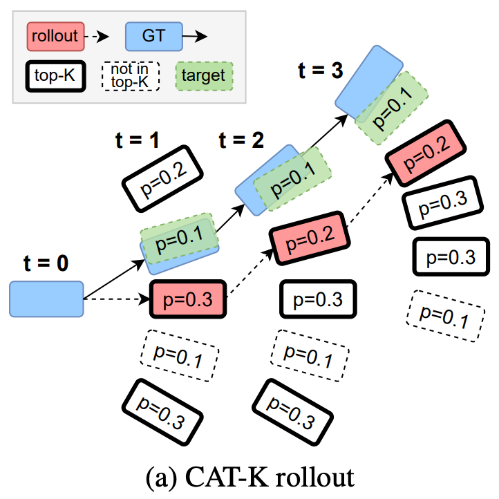

> 持续记录端到端自动驾驶的论文和认识。

## Insights
- <time class="date-tag">2025.07</time>业界的一阶段端到端方法已经开始使用超大量计算进行轨迹的预测任务了，包括可能10万小时以上的数据和千卡以上 GPU进行模仿学习的训练，证明Scaling Law在端到端预测轨迹的任务上依旧有效。根据语言模型的发展，强化学习的微调一定会是下一步的重点！
- <time class="date-tag">2025.06</time>Waymo的论文Scaling Laws of Motion Forecasting and Planning[^3]中使用了非常惊人的5000000小时的数据进行了IL的训练，远远超过开源数据集的训练量，模型的能力持续提升。IL中的OOD问题，是不是因为训练数据的投入远远不够？像LLM范式中的**Heavy** IL + RL finetune是否能在AI Planning中同样成功？
- <time class="date-tag">2025.03</time>当前绝大部分的E2E AD都采用了模仿学习(Imitation Learning, IL)，即使用大量的人类驾驶数据为监督学习驾驶行为，使用IL学习需要闭环反馈的驾驶行为存在很多问题。比较少数使用Model Based IL来同时学习World Model和Driving Policy[^1]。采用IL的模型普遍会遇到比较严重的泛化问题。


[^1]: [Model-based imitation learning for urban driving](https://arxiv.org/abs/2210.07729)
[^3]: [Scaling Laws of Motion Forecasting and Planning](https://arxiv.org/pdf/2506.08228)

## Lit Review
<details>
<summary><a href="https://arxiv.org/abs/2312.04535">Trajeglish: Traffic Modeling as Next-Token Prediction</a> 
Trajeglish文章最大的贡献是它提出的Motion Vocabulary，通过对所有Agent运动状态的相对位姿转移进行聚类(k-disks)而得到，是后续诸多工作的默认轨迹词表。
</summary>

k-disks聚类，这是一种逐步(随机)选择中心点，求中心点邻域内均值作为代表性中心点，再剔除掉中心点领域内的所有点，再剩余的所有点中随机选择中心点，然后重复直到选择出N个聚类中心点的方法。

为什么它能选择出来有代表性的中心点呢？尤其是后面是随机选择中心点。随机选择选中密集区域的概率远高于稀疏的区域，虽然确实有可能有一些离群中心点，但是绝大部分的中心点都是密集区域，并且通过取mean会获得有代表性的中心点。

代码很简单如下：
```python
def Kdisk_cluster(
   X,  # [n_trajs, 4, 2], bbox of the last point of the segment which is a_pos
   N,  # int
   tol = 0.05,  # 0.05m
   a_pos,  # [n_trajs, 6, 3], the complete segment
):
   n_total = X.shape[0]
   ret_traj_list = []

   for i in range(N):
       if i == 0:
           choice_index = 0  # always include [0, 0, 0]
       else:
           choice_index = torch.randint(0, X.shape[0], (1,)).item()
       x0 = X[choice_index]
       # res_mask = torch.sum((X - x0) ** 2, dim=[1, 2]) / 4.0 > (tol**2)
       res_mask = torch.norm(X - x0, dim=-1).mean(-1) > tol
       ret_traj = a_pos[~res_mask].mean(0, keepdim=True)

       X = X[res_mask]
       a_pos = a_pos[res_mask]
       ret_traj_list.append(ret_traj)

       remain = X.shape[0] * 100.0 / n_total
       n_inside = (~res_mask).sum().item()
       print(f"{i=}, {remain=:.2f}%, {n_inside=}")

   return torch.cat(ret_traj_list, dim=0)  # [N, 6, 3]
```
</details>

<details>
<summary>
<a href=https://arxiv.org/abs/2405.15677>SMART: Scalable Multi-agent Real-time Simulation via Next-token Prediction</a> SMART使用了Trajeglish中的离散轨迹词表，构建了一个全部交通要素的离散化、Next Token Prediction范式的交通轨迹模型，是所有交通参与者的下一步的联合概率建模。Waymo SimAgents榜单前几名都是对此方法的改进。
</summary>
- tSMART对交通的所有要素进行了离散化，包括所有Agents的状态、地图的所有多段线(Polyline)，以及我们要预测的所有Agent的轨迹，轨迹离散化采用的时Trajeglish的方式，0.5s的轨迹点。
- SMART论文中的网络结构示意图是Transformer Decoder，但是代码实现上采用的是图网络(GNN，使用PyTorch Geometric库)，构建了Agent时序，Agent和Map，Agent和Agent的时空Graph，然后巧妙将Transformer的基本操作全部嵌入其中。
</details>

<details>
<summary><a href=https://arxiv.org/abs/2412.05334>Closed-Loop Supervised Fine-Tuning of Tokenized Traffic Models</a>
CAT-K基于SMART进行了所谓的“闭环有监督微调”，(我认为)主要针对的是在Covariance Shift的问题，即Policy在进行序列预测时，会随着时间和误差的累计逐渐越错越大，所以也叫CAT-K Rollout。
</summary>

- SMART的Next token prediction训练如果从预测轨迹序列角度来看，可以看作是Teacher Forcing，即给定真值进行预测，而不是自回归预测，模型因此无法从错误的预测中恢复。
- CAT-K Rollout在进行序列预测时，会使用先选择Top K个候选，再选择Top-K中距离真值最近的那一个：
  - 红色是CAT-K Rollout的轨迹，虽然有绿色的候选，但是绿色并不在概率Top K之内，因此选择红色；但是，重要的是**绿色是我们预测的真值**
  - 
- CAT-K训练实现：
  - 使用Top-K和Distance进行采样：首先根据logits大小采样Top-K个，再将其赋值成与真值的距离，最后根据距离进行采样(`samples = Categorical(logits=topk_logits).sample()`)，代码参见[`sample_next_token_traj`](https://github.com/NVlabs/catk/blob/d23886761fc5b5628c5973148c40284452745745/src/smart/utils/rollout.py#L105C5-L105C27)。注意这里的采样保持着一定的探索性，虽然采样函数会返回`next_token_idx`，但是它是没有用处的，这个`token_idx`是上图中的红色框，而我们真正需要的是绿色的框！
  - 如何找到绿色框，即CAT-K Rollout的**Token Index**真值？代码见：[`get_euclidean_targets`](https://github.com/NVlabs/catk/blob/d23886761fc5b5628c5973148c40284452745745/src/smart/metrics/utils.py#L50)
    - 上图举例来说，例如要寻找`t=2`时刻的Token Index，我们需要退回到`t=1`时刻的Rollout的红色框，计算它与`t=2`时刻蓝色真值框的$\Delta x, \Delta y, \Delta \theta$，从Motion Vocab中寻找最近的Token。如此再每次Rollout时候，到达一个新的状态，我都知道哪个动作Token是可以会到GT轨迹的，即可以一定程度上解决Covariance Shift的问题。

</details>

<details>
<summary><a href=https://arxiv.org/abs/2309.16534>MotionLM: Multi-Agent Motion Forecasting as Language Modeling</a>
MotionLM同样是使用Next Token Prediction范式来建模轨迹预测的工作，相比SMART采用的是图网络来对交通元素提取特征，MotionLM更接近语言模型，但是并没有开源代码，所以并不知道具体实现。另外，**它采用的是x和y轴均匀的离散化方法来构建Motion Vocabulary。
</summary>

- [Scaling Laws of Motion Forecasting and Planning](https://arxiv.org/pdf/2506.08228)是这个方法的Scaling验证，使用了恐怖的50万小时数据来进行训练。
</details>
