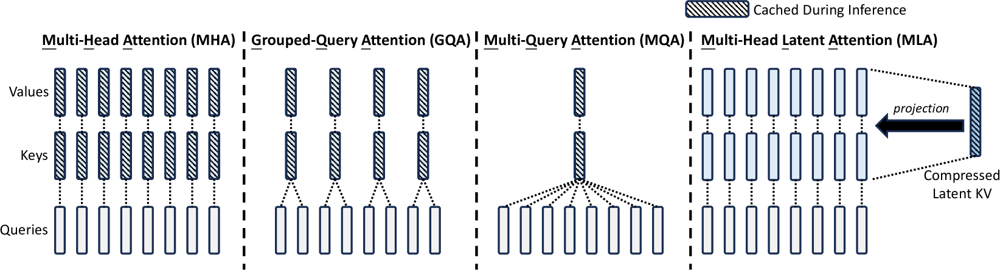

> 由于部署和调用LLM模型需求急速增加，迅速催生了LLM推理这一领域，围绕如何加快推理速度和成本首先从学术界出现大量结合系统领域知识的工作。本文是学习LLM推理的一些笔记。

## KV Cache
KV Cache是LLM推理优化中出现的第一个优化方法。理解KV Cache首先要了解LLM的推理过程的两点重要属性：1）**自回归(Autoregressive)**，2）Causal Masking。

自回归预测即next_token会加入到之前模型的输出中，再进行下一轮的预测。代码更能说明这个过程，见注释：
```python
@torch.no_grad()
def generate(self, input_idx, max_new_tokens, temperature=1.0):
    "Take a input sequence of indices and complete the sequence."
    for _ in range(max_new_tokens):
        idx_cond = input_idx if input_idx.size(1) <= self.block_size else input_idx[:, :self.block_size]
        # model接受用户输入进行计算，也称为profile阶段
        logits, _ = self(idx_cond) 
        # 注意logits只取最后一个单词，即预测next_token
        logits = logits[:, -1, :] / temperature # (b, c)
        prob = F.(logits, dim=-1)
        # idx_next = F.argmax(prob, dim=-1)
        idx_next = torch.multinomial(prob, num_samples=1) # (b, 1)
        # 这一步是Autogressive，输出token会加入到in_tokens
        # 模型会重新对加长的in_tokens进行推理
        input_idx = torch.cat((idx_cond, idx_next), dim = 1)

    return input_idx
```

`model(in_tokens)`这一步中的`in_tokens`会逐渐增加并重新进入`model`中经过Transformer中每一层进行计算，也就是说推理计算复杂度会随着`in_tokens`线性增加！

由于`in_tokens`之前的输出都是计算过的，是不是能在这里做优化呢？答案是可以，这推理过程中Attention计算中的[Causal Masking](https://www.s7ev3n.space/posts/transformer/#decoder)有关，即使用一个上三角矩阵来遮盖掉未来的信息。这和`in_tokens`的优化可以用下面例子来说明下。

假设`in_tokens`中有目前已经有两个`token`，即`in_tokens = [t1, t2]`，进入Transformer的每一层的MHA中每个head时，会将`t1`通过线性层映射成`q1, k1, v1`，然后计算注意力，为了说明问题只保留`q,k,v`的计算：
```
[q1*k1.T q1*k2.T] [1 0] [v1] = (q1 * k1.T) * v1
[q2*k1.T q2*k2.T] [1 1] [v2] = (q2 * k1.T) * v1 + (q2 * k2.T) * v2
```
然后使用`(q2*k1.T)*v1+(q2*k2.T)*v2`去预测下一个`token`，称之为`t3`。现在`in_tokens=[t1, t2, t3]`，输入到模型中再次进行计算：
```
[q1*k1.T q1*k2.T q1*k3.T] [1 0 0] [v1] = (q1 * k1.T) * v1
[q2*k1.T q2*k2.T q2*k3.T] [1 1 0] [v2] = (q2 * k1.T) * v1 + (q2 * k2.T) * v2
[q3*k1.T q3*k2.T q3*k3.T] [1 1 1] [v3] = (q3 * k1.T) * v1 + (q3 * k2.T) * v2 + (q3 * k3.T) * v3
```
我们看到，即使有`q1,q2`与`k3`的计算，但是由于causal masking，其值都无效，并且最后的输出`(q3*k1.T)*v1 +(q3*k2.T)*v2+(q3* k3.T)*v3`其实只与上一轮保存的`k1, v1, k2, v2`和当前这轮的`q3, k3, v3`即通过线性层映射后的结果有关。于是，我们缓存上一轮的`key`和`value`，这就是**KV Cache**！

:::tip
为什么不缓存`query`呢？看了上面的推导，应该很容易知道为什么不需要缓存上一轮的query！ ：）
:::

KV Cache的实现是在每一层Transformer层中的Attention部分，和上一层的`past_key_value`(即KV Cache)直接拼接，这篇博客[^1]的实现比较清晰：
```python
def mha(x, c_attn, c_proj, n_head, past_key_value=None):  # [n_seq, n_embd] -> [n_seq, n_embd]
    # qkv projection
    # n_seq = 1 when we pass past_key_value, so we will compute new_q, new_k and new_v
    x = linear(x, **c_attn)  # [n_seq, n_embd] -> [n_seq, 3*n_embd]

    # split into qkv
    qkv = np.split(x, 3, axis=-1)  # [n_seq, 3*n_embd] -> [3, n_seq, n_embd]

    if past_key_value:
        # qkv
        new_q, new_k, new_v = qkv  # new_q, new_k, new_v = [1, n_embd]
        old_k, old_v = past_key_value
        k = np.vstack([old_k, new_k]) # k = [n_seq, n_embd], where n_seq = prev_n_seq + 1
        v = np.vstack([old_v, new_v]) # v = [n_seq, n_embd], where n_seq = prev_n_seq + 1
        qkv = [new_q, k, v]

    current_cache = [qkv[1], qkv[2]]

    # split into heads
    qkv_heads = list(map(lambda x: np.split(x, n_head, axis=-1), qkv))  # [3, n_seq, n_embd] -> [n_head, 3, n_seq, n_embd/n_head]

    # causal mask to hide future inputs from being attended to
    if past_key_value:
        causal_mask = np.zeros((1, k.shape[0]))
    else:
        causal_mask = (1 - np.tri(x.shape[0])) * -1e10  # [n_seq, n_seq]

    # perform attention over each head
    out_heads = [attention(q, k, v, causal_mask) for q, k, v in zip(*qkv_heads)]  # [n_head, 3, n_seq, n_embd/n_head] -> [n_head, n_seq, n_embd/n_head]
    # merge heads
    x = np.hstack(out_heads)  # [n_head, n_seq, n_embd/n_head] -> [n_seq, n_embd]
    # out projection
    x = linear(x, **c_proj)  # [n_seq, n_embd] -> [n_seq, n_embd]

    return x, current_cache

```
[^1]: [Speeding up the GPT - KV cache](https://dipkumar.dev/becoming-the-unbeatable/posts/gpt-past_key_value/)

:::important
随着输入`in_tokens`变成超级长（1 Million），KV Cache也会成为显存杀手，其大小可能会远超模型权重，也成为后续工作优化的目标。
:::

## Multi-Head Attention的优化
在[Multi-Head Attention](https://www.s7ev3n.space/posts/transformer/#multi-head-attention)中，输入序列Embedding的`d_model`会被切分成`n_head`组，然后分别经过注意力计算后再`concat`起来还原`d_model`的长度。前面KV Cache最后提到过，当输入序列非常长，KV Cache会成为显存杀手，它就成为优化的目标！

下面的`Multi-Query Attention (MQA)` -> `Grouped-Query Attetion (GQA)` -> `Multi-head Latent Attention (MLA)`都是对MHA的改进！

### Multi-Query Attention
MQA来自于论文[Fast Transformer Decoding: One Write-Head is All
You Need](https://arxiv.org/pdf/1911.02150)，来自于Transformer论文的第二作者Noam Shazeer。

想法很简单：只对`Query`进行切分成`n_head`组，形状变为`(b, n_heads, t, d_h)`，但是`Key`和`Value`直接通过线性层映射到形状`(b, t, d_h)`，如此以来`W_k`和`W_v`的参数量急剧减少！注意，此时`Key`和`Value`和`Query`的形状是不能直接矩阵相乘的，可以利用广播Boardcast原则，在`Key`和`Value`的第二个维度增加1，即`(b, 1, t, d_h)`，这样会在矩阵乘法的时候自动在`n_haeds`的维度扩充进行相乘。

但是，MQA有明显的缺点：性能下降严重！需要完全重新训练MQA的模型，才能带来推理速度的加快。模型训练异常昂贵，训练性能下降的MQA不太划算。

:::important
如果搜索引擎搜索MQA，可能会见到mean pool和uptrain等奇怪的术语，这些并不出现在MQA的原论文中，而是在下面章节的[GQA](https://arxiv.org/pdf/2305.13245)论文中的uptraining章节。

uptraining将已经训练好的MHA的模型更好的转换成MQA的模型，而不用从头训练。具体操作分为两部分：1）将使用MHA训练好的checkpoint中的所有头的`W_k`和`W_v`投影矩阵进行平均值，从而获得类似MQA原文中的、单个的`W_k`和`W_v`，即所谓的mean pool；2）对于合并后的模型，再使用训练非常小的轮次，让模型适应合并的权重，相当于训练得到了新的、省KV Cache的部署模型。实验发现这样比MQA的性能更好，而且更省计算。
:::

### Grouped Query Attention
[GQA](https://arxiv.org/pdf/2305.13245)是MHA和MQA的一般情况，其想法也很直接：如果一组`Key`和`Value`性能下降，那么多搞几组`Key`和`Value`吧。

让Deepseek对上面的`mha`改造成`gqa`:

<details>
<summary><code>gqa</code>实现</summary>

```python
def gqa(x, c_attn, c_proj, n_head, n_group, past_key_value=None):  # [n_seq, n_embd] -> [n_seq, n_embd]
    assert n_head % n_group == 0, "n_head must be divisible by n_group"
    
    # 计算每个头的维度
    n_embd_input = x.shape[-1]
    d = n_embd_input // n_head  # 每个头的维度
    
    # QKV投影
    x = linear(x, **c_attn)  # [n_seq, n_embd_input] -> [n_seq, (n_head + 2*n_group)*d]
    
    # 分割Q、K、V
    q_size = n_head * d
    k_size = n_group * d
    v_size = n_group * d
    
    q = x[:, :q_size]
    k = x[:, q_size : q_size + k_size]
    v = x[:, q_size + k_size : q_size + k_size + v_size]
    
    # 合并历史KV缓存
    if past_key_value:
        old_k, old_v = past_key_value
        k = np.vstack([old_k, k])
        v = np.vstack([old_v, v])
    current_cache = [k, v]
    
    # 分割成头
    q_heads = np.split(q, n_head, axis=-1)  # [n_head, n_seq, d]
    k_heads = np.split(k, n_group, axis=-1)  # [n_group, n_seq, d]
    v_heads = np.split(v, n_group, axis=-1)
    
    # 因果掩码
    if past_key_value:
        causal_mask = np.zeros((q.shape[0], k.shape[0]))  # 允许关注所有历史位置
    else:
        causal_mask = (1 - np.tri(q.shape[0], k.shape[0])) * -1e10  # 下三角掩码
    
    # 计算每个查询头对应的组
    group_size = n_head // n_group
    out_heads = []
    for i in range(n_head):
        g = i // group_size  # 确定当前头所属的组
        q_i = q_heads[i]
        k_g = k_heads[g]
        v_g = v_heads[g]
        out_head = attention(q_i, k_g, v_g, causal_mask)
        out_heads.append(out_head)
    
    # 合并多头输出
    x = np.hstack(out_heads)
    
    # 输出投影
    x = linear(x, **c_proj)
    
    return x, current_cache
```
</details>

### Multi-head Latent Attention
MLA出现在[Deepseek-V2](https://arxiv.org/abs/2405.04434)技术报告中，实现了比MHA性能好，并且KV Cache大幅降低！从下图中，体会一下从各种MHA优化的区别：



使用一个新的向量$\mathbf{c}^{KV}$作为Key和Value共同的latent向量，$\mathbf{c}^{KV}$的维度`d_c`远小于输入Embedding的维度`d_model`，并且只缓存这个$\mathbf{c}^{KV}$用于推理。论文中使用一个下投影(down-projection)矩阵将输入从`d_model`投影到`d_c`，这个过程被称为Low-Rank Key-Value Joint Compression。按照苏神的文章[^2]，其实GQA也做了低秩投影，所以它并不是MLA的主要改进点。GQA或者MQA在低秩投影后和Query相乘时，直接复制Key和Value，这相当于削弱了KV的表达。MLA使用了上投影(up-projection)将Key和Value维度又变成`d_model`，这样Key和Value不是简单的复制：

$$
\begin{aligned}
    \mathbf{c}_t^{KV} &= \mathbf{h}_t W^{DKV} \in \mathbb{R}^{1 \times d_c} \\
    \mathbf{k}_t^{C} &= \mathbf{c}_t^{KV} W^{UK} \in \mathbb{R}^{1 \times d_{model}} \\
    \mathbf{v}_t^{C} &= \mathbf{c}_t^{KV} W^{UV} \in \mathbb{R}^{1 \times d_{model}}
\end{aligned}
$$
其中，$\mathbf{h}_t\in \mathbb{R}^{1 \times d_{model}}$是$t$时刻的输入Embedding，$\mathbf{c}_t^{KV} \in \mathbb{R}^{1 \times d_c}$是Key和Value共享的压缩后的向量，$W_{DKV} \in \mathbb{R}^{d_{model} \times d_c}$是down-projection($D$表示的是Down)，矩阵
$W_{UK},W_{UV} \in \mathbb{R}^{d_{c} \times d_{model}}$是up-projection矩阵($U$表示的是Up)，有点像CNN中的bottleneck。

:::important
这里的$\mathbf{k}_t^{C}$和$\mathbf{v}_t^{C}$是要和所有的Head的Query共享的，像MQA一样。
:::

问题来了，如果最后还是还原到$\mathbf{k}_t^{C}$和$\mathbf{v}_t^{C}$并缓存，那这和原来MHA的方法一样，并没有节省推理时候的显存。实际上，在训练过程中，Key和Value和原来MHA是一样的，并没有什么优化。

但是MLA发现，如果结合注意力Attention计算的内积相乘：
$$
\mathbb{q}_t \mathbf{k}_t^{\top} = 
(\mathbf{h}_t W^Q)(\mathbf{c}_t^{KV}W^{UK})^{\top} =
\mathbf{h}_t (W^Q {W^{UK}}^{\top}){\mathbf{c}_t^{KV}}^{\top}
$$

你会发现两者相乘，**不需要中间的$\mathbf{k}_t^{C}$和$\mathbf{v}_t^{C}$**！$W^Q {W^{UK}}^{\top}\in \mathbb{R}^{d_{model}\times d_c}$在推理阶段可以合并为一个矩阵，只要保存$\mathbf{c}_t^{KV}$。

:::important
但就像苏神在文章[^2]说的$W^Q {W^{UK}}^{\top}$还是有精度问题的，尤其用低精度BF16训练时。
:::

还有$\mathbf{v}_t^{C}$怎么办？我们知道对每个Head的$\mathbf q_{t,i}$的输出有：
$$
\begin{aligned}
    \mathbf{o}_{t,i} &= \sum_{j=1}^{t} \mathrm{softmax_j}\left(\frac{\mathbf q_{t,i} \mathbf {k_{t}^{C}}^\top }{\sqrt{d_h}}\right) \cdot \mathbf{v}_t^{C} \\
    \mathbf{u}_t &=  [\mathbf{o}_{t,1}; \mathbf{o}_{t,2};...;\mathbf{o}_{t,n_h}] \mathbf{c}_t^{KV} W^{UV} W^{O} =
    \mathbf{o}_t \mathbf{c}_t^{KV} W^{UV} W^{O}
\end{aligned}
$$
即最后还有一个线性投影$W^{O}$将attention计算之后的值做最后的投影输出，这样最后$W^{UV} W^{O}$也可以合并成一个矩阵！

至此，MLA已经实现了推理时只缓存类似MQA的$\mathbf{c}_t^{KV}$，并且可以把矩阵合并到一起！另外需要说的是，最后对Query也进行了类似的压缩，虽然不能再推理时起到省KV Cache的作用，但是训练时可以省一部分激活值的内存。

但是，还有一个问题，现在MLA不支持[RoPE](https://www.s7ev3n.space/posts/pe/)，我们知道RoPE是一种在Attention计算时候加入的和绝对位置相关的乘性位置编码，作用于Query和Key，如果尝试给它们加入RoPE，假设RoPE的旋转矩阵是$R_t$:
$$
\mathbb{q}_m \mathbf{k}_n^{\top} = 
\mathbf{h}_m (W^Q R_{m-n} {W^{UK}}^{\top}){\mathbf{c}_n^{KV}}^{\top}
$$
这样矩阵就无法合并成一个固定的矩阵了，而是带着相对位置向量矩阵$R_{m-n}$。

解决方案是让Query和Key都新增$d_r$，然后仅在$d_r$维度上使用RoPE，而原来的$d_c$维度依旧使用原MLA的矩阵乘法，文中称为Decoupled RoPE:
$$
\begin{aligned}
    \mathbf{q}_t &=[\mathbf{c}_t^{Q} W^{DQ},RoPE(\mathbf{c}_{t}^{R}W^{QR})] \in \mathbb{R}^{d_c+d_r} \\
    \mathbf{k}_t &= [\mathbf{c}_t^{KV}W^{UK},RoPE(\mathbf{h}_{t}^{R}W^{KR})] \in \mathbb{R}^{d_c+d_r}
\end{aligned}
$$
根据矩阵分块相乘，前$d_c$维度只会自己相乘，后$d_r$维度自己相乘，后$d_r$维度带着相对位置关系编码。因此，需要额外的缓存$\mathbf{k}_t$中的$d_c$部分。

[^2]: [缓存与效果的极限拉扯：从MHA、MQA、GQA到MLA](https://spaces.ac.cn/archives/10091)

对比下`Multi-Query Attention (MQA)` -> `Grouped-Query Attetion (GQA)` -> `Multi-head Latent Attention (MLA)`的缓存：
| Attention Type                | KV Cache     | Performance |
|:------|:-----:|------:|
| Multi-Head Attention (MHA)    | $2n_h d_h l$ |  Strong     |
| Grouped-Query Attention (GQA) | $2n_g d_h l$ | Moderate    |
| Multi-Query Attention (MQA)   | $2 d_h l$    | Weak        |
| MLA           | $(d_c+d_r)l\approx \frac{9}{2}d_h l$ | Stronger |

其中，$n_h$是head的数量，$d_h$是head的维度，$l$是Transformer的层数，$n_g$是GQA的组数，$d_c$和$d_r$分别是latent向量和rope额外向量的维度，Deepseek中$d_c=4d_h$，$d_r=0.5d_h$

MLA的具体实现，从Deepseek官方代码中可以找到：
```python
attn_impl: Literal["naive", "absorb"] = "absorb"
class MLA(nn.Module):
    """
    Multi-Headed Attention Layer (MLA).

    Attributes:
        dim (int): Dimensionality of the input features.
        n_heads (int): Number of attention heads.
        n_local_heads (int): Number of local attention heads for distributed systems.
        q_lora_rank (int): Rank for low-rank query projection.
        kv_lora_rank (int): Rank for low-rank key/value projection.
        qk_nope_head_dim (int): Dimensionality of non-positional query/key projections.
        qk_rope_head_dim (int): Dimensionality of rotary-positional query/key projections.
        qk_head_dim (int): Total dimensionality of query/key projections.
        v_head_dim (int): Dimensionality of value projections.
        softmax_scale (float): Scaling factor for softmax in attention computation.
    """
    def __init__(self, args: ModelArgs):
        super().__init__()
        self.dim = args.dim
        self.n_heads = args.n_heads
        self.n_local_heads = args.n_heads // world_size
        self.q_lora_rank = args.q_lora_rank
        self.kv_lora_rank = args.kv_lora_rank # d_c
        self.qk_nope_head_dim = args.qk_nope_head_dim
        self.qk_rope_head_dim = args.qk_rope_head_dim #d_r
        self.qk_head_dim = args.qk_nope_head_dim + args.qk_rope_head_dim
        self.v_head_dim = args.v_head_dim

        if self.q_lora_rank == 0:
            self.wq = ColumnParallelLinear(self.dim, self.n_heads * self.qk_head_dim)
        else:
            self.wq_a = Linear(self.dim, self.q_lora_rank) # W^DQ
            self.q_norm = RMSNorm(self.q_lora_rank) # Norm只用在了d_c，没有用在d_r
            self.wq_b = ColumnParallelLinear(self.q_lora_rank, self.n_heads * self.qk_head_dim) # W^UQ
        self.wkv_a = Linear(self.dim, self.kv_lora_rank + self.qk_rope_head_dim) # W*DKV
        self.kv_norm = RMSNorm(self.kv_lora_rank)
        self.wkv_b = ColumnParallelLinear(self.kv_lora_rank, self.n_heads * (self.qk_nope_head_dim + self.v_head_dim))
        self.wo = RowParallelLinear(self.n_heads * self.v_head_dim, self.dim)
        self.softmax_scale = self.qk_head_dim ** -0.5
        if args.max_seq_len > args.original_seq_len:
            mscale = 0.1 * args.mscale * math.log(args.rope_factor) + 1.0
            self.softmax_scale = self.softmax_scale * mscale * mscale

        if attn_impl == "naive":
            self.register_buffer("k_cache", torch.zeros(args.max_batch_size, args.max_seq_len, self.n_local_heads, self.qk_head_dim), persistent=False)
            self.register_buffer("v_cache", torch.zeros(args.max_batch_size, args.max_seq_len, self.n_local_heads, self.v_head_dim), persistent=False)
        else:
            self.register_buffer("kv_cache", torch.zeros(args.max_batch_size, args.max_seq_len, self.kv_lora_rank), persistent=False)
            self.register_buffer("pe_cache", torch.zeros(args.max_batch_size, args.max_seq_len, self.qk_rope_head_dim), persistent=False)

    def forward(self, x: torch.Tensor, start_pos: int, freqs_cis: torch.Tensor, mask: Optional[torch.Tensor]):
        """
        Forward pass for the Multi-Headed Attention Layer (MLA).

        Args:
            x (torch.Tensor): Input tensor of shape (batch_size, seq_len, dim).
            start_pos (int): Starting position in the sequence for caching.
            freqs_cis (torch.Tensor): Precomputed complex exponential values for rotary embeddings.
            mask (Optional[torch.Tensor]): Mask tensor to exclude certain positions from attention.

        Returns:
            torch.Tensor: Output tensor with the same shape as the input.
        """
        bsz, seqlen, _ = x.size()
        end_pos = start_pos + seqlen
        if self.q_lora_rank == 0:
            q = self.wq(x)
        else:
            q = self.wq_b(self.q_norm(self.wq_a(x)))
        q = q.view(bsz, seqlen, self.n_local_heads, self.qk_head_dim)
        q_nope, q_pe = torch.split(q, [self.qk_nope_head_dim, self.qk_rope_head_dim], dim=-1)
        q_pe = apply_rotary_emb(q_pe, freqs_cis)
        kv = self.wkv_a(x)
        kv, k_pe = torch.split(kv, [self.kv_lora_rank, self.qk_rope_head_dim], dim=-1)
        k_pe = apply_rotary_emb(k_pe.unsqueeze(2), freqs_cis)
        if attn_impl == "naive":
            q = torch.cat([q_nope, q_pe], dim=-1)
            kv = self.wkv_b(self.kv_norm(kv))
            kv = kv.view(bsz, seqlen, self.n_local_heads, self.qk_nope_head_dim + self.v_head_dim)
            k_nope, v = torch.split(kv, [self.qk_nope_head_dim, self.v_head_dim], dim=-1)
            k = torch.cat([k_nope, k_pe.expand(-1, -1, self.n_local_heads, -1)], dim=-1)
            self.k_cache[:bsz, start_pos:end_pos] = k
            self.v_cache[:bsz, start_pos:end_pos] = v
            scores = torch.einsum("bshd,bthd->bsht", q, self.k_cache[:bsz, :end_pos]) * self.softmax_scale
        else:
            wkv_b = self.wkv_b.weight if self.wkv_b.scale is None else weight_dequant(self.wkv_b.weight, self.wkv_b.scale, block_size) 
            wkv_b = wkv_b.view(self.n_local_heads, -1, self.kv_lora_rank)
            q_nope = torch.einsum("bshd,hdc->bshc", q_nope, wkv_b[:, :self.qk_nope_head_dim])
            self.kv_cache[:bsz, start_pos:end_pos] = self.kv_norm(kv)
            self.pe_cache[:bsz, start_pos:end_pos] = k_pe.squeeze(2)
            scores = (torch.einsum("bshc,btc->bsht", q_nope, self.kv_cache[:bsz, :end_pos]) +
                      torch.einsum("bshr,btr->bsht", q_pe, self.pe_cache[:bsz, :end_pos])) * self.softmax_scale
        if mask is not None:
            scores += mask.unsqueeze(1)
        scores = scores.softmax(dim=-1, dtype=torch.float32).type_as(x)
        if attn_impl == "naive":
            x = torch.einsum("bsht,bthd->bshd", scores, self.v_cache[:bsz, :end_pos])
        else:
            x = torch.einsum("bsht,btc->bshc", scores, self.kv_cache[:bsz, :end_pos])
            x = torch.einsum("bshc,hdc->bshd", x, wkv_b[:, -self.v_head_dim:])
        x = self.wo(x.flatten(2))
        return x
```
