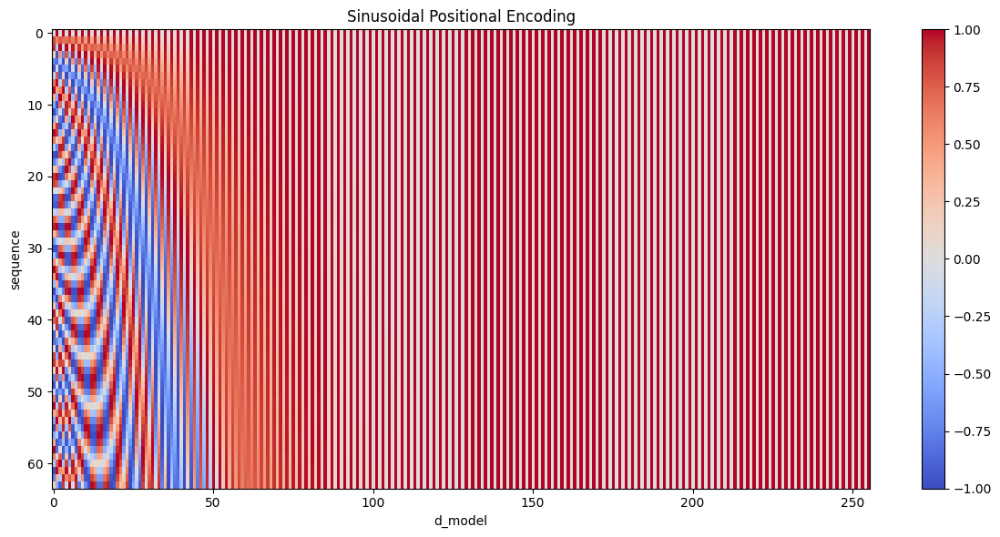

> Transformer由论文[Attention Is All You Need](https://arxiv.org/abs/1706.03762)提出，开启了AI的Transformer时代，几乎所有的模型都可以见到它的身影。Transformer主要由题图中的三个部分组成：scaled dot-product attention, multi-head attention，transformer encoder-decoder。这篇笔记主要以这三部分为大纲，每个部分会包括模块的解读和代码实现细节。

## Scaled dot-product attention
缩放点积注意力(scaled dot-product attention)首先由注意力评分函数建模查询$\mathbf{query}$和键$\mathbf{key}$之间的关系，然后将评分值送入$softmax$函数中，得到查询$\mathbf{query}$和键$\mathbf{key}$的概率分布(注意力权重)，最后基于注意力权重对值$\mathbf{value}$计算加权，如下图[^1]


缩放点积注意力的注意力评分函数$f_{attn}$是$\mathbf{query}$向量和$\mathbf{key}$向量的点积，即向量之间的相似度，并除以向量的长度$d$($\mathbf{query}$和$\mathbf{key}$具有相同的长度$d$):

$$
f_{attn}(\mathbf q, \mathbf k) = \frac{\mathbf{q} \mathbf{k}^\top }{\sqrt{d}} \in \mathbb R^{b \times n \times m}
$$ 

> 为什么要除以$\sqrt{d}$ ? 假设$\mathbf{query}$向量和$\mathbf{key}$向量的所有元素都是独立的随机变量，并且都满足零均值和单位方差，那么两个向量的点积的均值为$0$，方差为$d$。为确保无论向量长度如何，点积后的方差在不考虑向量长度的情况下仍然是单位方差，我们再将点积除以$\sqrt{d}$ [^1]。另外从实际的计算角度看，$\mathbf{query}$向量和$\mathbf{key}$向量的点积值可能会很大，过大的权重影响softmax的输出，使得某些评分值接近1，某些趋近0，使得梯度的计算可能不稳定。

$\mathbf{query}$，$\mathbf{key}$和$\mathbf{value}$都是张量的形式，例如 $\mathbf q\in\mathbb R^{b \times n\times d}$，$\mathbf k\in\mathbb R^{b \times m\times d}$，$\mathbf v\in\mathbb R^{b \times m \times v}$，其中$b$代表batchsize，有$n$个查询$\mathbf{query}$，$m$个$\mathbf{key}$和$\mathbf{value}$。

<span style="color: gray">你可能注意到了$\mathbf{query}$的数量$n$可以和$\mathbf{key}$的数量$m$不同，但是向量的长度$d$必须相同；$\mathbf{key}$和$\mathbf{value}$的数量必须相同，但是向量的长度可以不同。但是在Transformer的自注意力self-attention中，由于是自注意力，数量和向量长度都是相同的。</span>

最后，缩放点积注意力模块$f_{sda}$是对$\mathbf{value}$的加权和：

$$
f_{sda}=\mathrm{softmax}\left(\frac{\mathbf q \mathbf k^\top }{\sqrt{d}}\right) \cdot \mathbf V \in \mathbb{R}^{b \times n\times v}
$$ 

### Attention implementation
缩放点积注意力`attention`的实现如下代码，代码中包括如何计算加权和的具体例子，另外，其中的`attn_mask`在[Masked multi-head attention](#decoder)中更进一步解读。

```python
def attention(query, key, value, attn_mask=None, dropout=None):
  """Scaled Dot Product Attention.

    Attention(Q, K, V) = softmax(Q * K.T / sqrt(d_k)) * V
    
    Params:
        query: (b, t, d_k)
        key  : (b, t, d_k)
        value: (b, t, d_k)
    Returns:
        result: (b, t, d_k)
        attn  : (b, t, t)
        
    Attetion detail: 
    a query vector (1, d_k) calcuates its similarity (vector dot product)
    with a sequence key vectors (t, d_k), and the output (1, t) is the query's
    attention with t key vectors, by multiplying with value (t, d_k), the
    output (1, d_k) is a weighted sum over value features, which is the most
    representative features related with query feature. It could easily extend
    to a sequence of query vectors (t, d_k), the output is a attention matrix of 
    shape (t, t), the rest is the same.
    
    A more concrete example, suppose query (3, 2), key (3, 2) and value (3, 2),
    the attention matrix (3, 3) show below:
                               [1.0 , 0.0 , 0.0 ]
                               [0.5 , 0.5 , 0.0 ]
                               [0.33, 0.33, 0.33]
    Let's make value vector (3, 2) more concrete to see weighted sum over value
    (keep in mind that each row in value vector (1, 2) is a feature vector):
                                   [1, 2]
                                   [4, 5]
                                   [7, 8]
    and after attn * value:
                                 [1.0, 2.0]
                                 [2.5, 3.5]
                                 [4.0, 5.0]
    Each element in a row of attention matrix specifies how each value vector is 
    summed, 
    e.g. [0.5, 0.5, 0.0] specifies 0.5 * [1 2] + 0.5 * [4 5] + 0 * [7 8] = [2.5 3.5]
    PS: see video 
    https://www.youtube.com/watch?v=kCc8FmEb1nY&list=PLAqhIrjkxbuWI23v9cThsA9GvCAUhRvKZ&index=7&t=2533s
    """
    d_k = query.size(-1)
    score = torch.matmul(query, key.transpose(-1, -2)) / math.sqrt(d_k) # (b, t, t)

    if attn_mask is not None:
        # NOTE: Why set mask position to -np.inf ?
        # 1. Make sure masking position has no effect, set to 0 DO NOT lead to probability 0 using softmax!
        # 2. Softmax will give close to 0.0 prob to -np.inf but not 0.0 to avoid gradient vanishing
        # 3. For computation stability, to avoid underflow
        score = score.masked_fill(attn_mask == 0, -1e9)
    
    attn = nn.functional.softmax(score, dim=-1)
    if dropout is not None:
        attn = dropout(attn)

    return torch.matmul(attn, value), attn

```

## Multi-head attention
多头注意力(Multi-head attention, MHA)将$\mathbf{query}$，$\mathbf{key}$和$\mathbf{value}$的向量长度$d$切分成更小的几($n_{head}$)组，每组称为一个头，每个头的向量长度是$d=\frac{d_{model}}{n_{head}}$，每个头内**并行**的进行缩放点积注意力计算，并在每个头计算结束后连结(`concat`)起来，再经过一个全连接层后输出，如下图所示：


> 为什么要分成多个头来计算？当给定相同的查询、键和值的集合时，我们希望模型可以基于相同的注意力机制学习到不同的行为，然后将不同的行为作为知识组合起来，捕获序列内各种范围的依赖关系(例如，短距离依赖和长距离依赖关系)。因此，允许注意力机制组合使用查询、键和值的**不同子空间表示(representation subspaces)**可能是有益的[^1]。基于这种设计，每个头都可能会关注输入的不同部分，可以表示比简单加权平均值更复杂的函数

$\mathbf{q_i} \in \mathbb{R}^{b \times n \times n_{head} \times d_q}$、$\mathbf{k_i} \in \mathbb{R}^{b \times m \times n_{head} \times d_k}$和$\mathbf{v_i} \in \mathbb{R}^{b \times m \times n_{head} \times d_v}$，每个注意力头$h_i(i=1,...,n_{head})$的计算方法为：

$$
\mathbf{h}_i = f_{sda}(\mathbf W_i^{(q)}\mathbf q_i, \mathbf W_i^{(k)}\mathbf k_i,\mathbf W_i^{(v)}\mathbf v_i) \in \mathbb R^{b \times n \times n_{head} \times d_v}
$$

其中，可学习的参数包括$\mathbf W_i^{(q)}\in\mathbb R^{d_{model}\times d_q}$，$\mathbf W_i^{(k)}\in\mathbb R^{d_{model}\times d_k}$和$\mathbf W_i^{(v)}\in\mathbb R^{d_{model}\times d_v}$。多头注意力的输出需要经过另一个全连接层转换，它对应着$h$个头连结(`concat`)后的结果，因此其可学习参数是$\mathbf W_o\in\mathbb R^{d_{model}\times d_{model}}$:

$$
\begin{split}
\mathbf W_o \begin{bmatrix}\mathbf h_1\\\vdots\\\mathbf h_{n_{head}} \end{bmatrix} \in \mathbb{R}^{b \times n \times d_{model}}
\end{split}
$$

其中$n_{head}$是超参数，并且$d_{model}=n_{head}\cdot d_{q}=n_{head}\cdot d_{k}=n_{head}\cdot d_{v}$关系。

### MHA implementation
实现`MHA`时，不必为每个头单独建立单独的全连接层，而是通过整体的矩阵计算，再计算后分到各个头上进行注意力计算。下面的实现是Transformer中`self-attention`，其中的$\mathbf{q}$，$\mathbf{k}$和$\mathbf{v}$的向量长度都相同：
```python
class MultiHeadAttention(nn.Module):
    def __init__(self, d_model, n_heads, dropout=0.1):
        super(MultiHeadAttention, self).__init__()
        self.n_heads = n_heads
        self.d_model = d_model
        self.W_q = nn.Linear(d_model, d_model, bias=False)
        self.W_k = nn.Linear(d_model, d_model, bias=False)
        self.W_v = nn.Linear(d_model, d_model, bias=False)
        self.l = nn.Linear(d_model, d_model, bias=False)
        self.dropout = nn.Dropout(dropout)

    def forward(self, q, k, v, mask = None):
        # q, k, v : (b, t, d_model)
        b, t, d_model = q.size()

        q = self.W_q(q) # (b, t, d_model)
        k = self.W_k(k)
        v = self.W_v(v)
        
        q = q.view(b, t, self.n_heads, d_model // self.n_heads).transpose(1, 2)
        k = k.view(b, t, self.n_heads, d_model // self.n_heads).transpose(1, 2)
        v = v.view(b, t, self.n_heads, d_model // self.n_heads).transpose(1, 2) # (b, n_heads, t, d_h)
        
        x, attn = attention(q, k, v, attn_mask=mask, dropout=self.dropout)
        # x -> (b, n_heads, t, d_h), attn -> (b, n_heads, t, t)
        x = x.transpose(1, 2) # -> (b, t, n_heads, d_h)
        # it is necessary to add contiguous here
        x = x.contiguous().view(b, t, d_model) # -> (b, t, n_heads * d_h)
        res = self.l(x) # (b, t, d_model)
    
        return res 
```

## Transformer architecture
Transformer原文中提出的是Encoder-decoder的架构，如下图所示。
`input embedding`在进入编码器`Encoder`前，通过与`Positional Encoding`相加获得位置信息，(<span style="color: gray">Position Encoding只在这里输入相加一次，与DETR，DETR3D等视觉Transformer不同</span>）。

编码器`Encoder`有两部分：注意力` Multi-head attention`模块和`Feedforward`模块，每个模块都包括一个残差连接`Residual`，并且这里有一个比较重要的细节是`Norm`的位置，图中所示是`post-norm`，而目前很多实现中使用的是`pre-norm`。

解码器`Decoder`和编码器`Encoder`很类似，不同的是在解码`embedding`输入后，使用了`Masked MHA`，即掩码掉未来的信息。

Transformer的`base`版本，使用了$6$层`Encoder`和$6$层`Decoder`，$d_{model}=512$，多头注意力的$n_{head}=8$，因此每个头中的$d_q=d_k=d_v=64$，`Feedforward`的线性层是$2048$，以及$p_{drop}=0.1$


### Positional encoding
自注意力机制中序列每个$\mathbf{q_i}$和所有$\mathbf{q}$进行注意力计算后的输出与$\mathbf{q_i}$在序列中的顺序无关，无法对序列元素之间关系进行建模，因此，需要显式地给每个$\mathbf{q}$向量提供位置信息。位置编码向量是与$\mathbf{q}$向量维度相同的向量，位置编码向量可以通过特定假设编码得到，也可以是可学习位置编码，位置编码与$\mathbf{q}$向量相加，可以将位置信息编码到$\mathbf{q}$向量中。

Transformer中使用的是正弦编码，是一种**绝对位置编码**：假设输入序列$\mathbf{X} \in \mathbb{R}^{n \times d}$是包含$n$个长度为$d$的$\mathbf{q}$向量的矩阵，位置编码使用相同形状的位置嵌入矩阵$\mathbf{P} \in \mathbb{R}^{n \times d}$，并和输入相加得到输出$\mathbf{X} + \mathbf{P}$，矩阵第$i$行(表示序列中的位置)，第$2j$列和第$2j+1$列(表示每个位置的值)的元素为：

$$
\begin{aligned} 
p_{pos, 2j} &= \sin\left(\frac{pos}{10000^{2i/d}}\right) \\
p_{pos, 2j+1} &= \cos\left(\frac{pos}{10000^{2i/d}}\right)
\end{aligned}
$$

从上面的公式可以知道，当$i$增大时候，分母$10000^{\frac{2i}{d}}$会迅速变大，导致$\frac{pos}{10000^{2i/d}}$迅速趋近于0，正弦函数会接近0和余弦函数会接近1.因此，在位置编码在$d$维度越靠后越接近0和1交替，位置靠前的元素位置编码的值会变化的更快，如下图：

<details>
<summary><code>PositionEncoding</code>可视化</summary>



</details>

<details>
<summary><code>PositionEncoding</code>实现</summary>
    
```python
class PositionEncoding(nn.Module):
    """Position Encoding.

    Positional encoding will sum with input embedding to give 
    input embedding order information.
    Positional encoding is given by the following equation:
    
    PE(pos, 2i)     = sin(pos / (10000 ^ (2i / d_model)))
    PE(pos, 2i + 1) = cos(pos / (10000 ^ (2i / d_model)))
    # for given position odd end even index are alternating
    # where pos is position in sequence and i is index along d_model.
    
    The positional encoding implementation is a matrix of (max_len, d_model), 
    this matrix is not updated by SGD, it is implemented as a buffer of 
    nn.Module which is the state of of the nn.Module.
    
    Note: For max_len, it usually aligns with the sequence length, 
    do not have to be 1024.

    Detail 1:
    In addition, we apply dropout to the sums of the embeddings and the 
    positional encodings in both the encoder and decoder stacks. For the 
    base model, we use a rate of P_drop = 0.1
    """
    def __init__(self, d_model, dropout=0.1, max_len=1024):
        super(PositionEncoding, self).__init__()
        self.dropout = nn.Dropout(p=dropout)

        pe = torch.zeros(max_len, d_model, requires_grad=False)
        pos = torch.arange(0, max_len).unsqueeze(1) # (max_len, 1)
        demonitor = torch.pow(10000, torch.arange(0, d_model, 2) / d_model) 
        # pos/demonitor is broadcastable
        
        pe[:, 0::2] = torch.sin(pos / demonitor)
        pe[:, 1::2] = torch.cos(pos / demonitor)
        pe = pe.unsqueeze(0) # (1, max_len, d_model)
        self.register_buffer('pe', pe)

    def forward(self, x):
        # x: (b, t, d_model)
        # self.pe[:, :x.size(1)] will return a new tensor, not buffer anymore
        # by default the new tensor's requires_grad is Fasle, but here we refer
        # to The Annotated Transformer, use in_place requires_grad_(False)
        # max_len is much longer than t
        x = x + self.pe[:, : x.size(1)].requires_grad_(False) 
        return self.dropout(x)
```

</details>

### Encoder
基本的编码器`Encoder`有两部分：`MHA`模块和`Feedforwad`模块，每个模块都包括一个残差连接`Residual`和`Norm`。其中遇到的第一个细节是`Norm`的位置，一般有两种：`pre-norm`和`post-norm`。`post-norm`是`LayerNorm(x+sublayer(x))`，是原文中所采用的，在后序的工作中，很多情况下被改成了`pre-norm`； `pre-norm`是`x+sublayer(LayerNorm(x))`，即将`Normalization`的位置提前到了`MHA`或`FFN`之前。从下面的`SublayerResidual`实现看`Norm`的位置：
```python
class SublayerResidual(nn.Module):
    def __init__(self, d_model=512, dropout=0.1):
        super(SublayerResidual, self).__init__()
        self.ln = nn.LayerNorm(d_model) 
        self.dropout = nn.Dropout(dropout)

    def forward(self, x, sublayer):
        """
        x: input
        sublayer: MHA or FFN

        Detail 1:
        Note implementation here is pre-norm formulation:
            x + sublayer(LayerNorm(x))       
        Origin paper is using post-norm:
            LayerNorm(x+sublayer(x))
        There are literatures about the pros and cons of 
        pre-norm and post-norm[1,2].

        Detail 2:
        We apply dropout to the output of each sub-layer, 
        before it is added to the sublayer input and normalized.

        Reference: 
        1. https://youtu.be/kCc8FmEb1nY?list=PLAqhIrjkxbuWI23v9cThsA9GvCAUhRvKZ&t=5723
        2. https://kexue.fm/archives/9009
        """
        return x + self.dropout(sublayer(self.ln(x)))
```

> 另外，Transformer使用的是LayerNorm：**为什么使用的是LayerNorm，而不是CNN时代的BatchNorm ?**
> 首先，理解LayerNorm和BatchNorm的区别：统计均值和方差的维度不同，假设$q \in \mathbf{R}^{b \times t \times d}$，LayerNorm在$d$的维度对每个$t$统计，BatchNorm在$b$维度对每个$t$统计。
> 
> BatchNorm统计的是batch的信息，而LayerNorm统计的是每个样本的信息；由于Transformer是序列任务，长度可能会经常变换，所以显然LayerNorm不受影响，更适合。同时在Transformer中，LayerNorm会使得训练更稳定。

### Decoder
`Decoder`与`Encoder`的区别并不太大，主要的区别是`Decoder`使用掩码自注意力(`Masked MHA`)掩码发生在 `attention` 函数中，将$\mathbf{query}$和$\mathbf{key}$相乘得到的`attention score matrix`根据`attention mask`遮盖掉不需要的`attention score`，前面[`attention`](#Attention-implementation)的实现中，有一个`attn_mask`参数，就是这里的掩码。

```python
if attn_mask is not None:
    score = score.masked_fill(attn_mask == 0, -1e9)
```

传入的`attention mask`有很多名称，但是核心的目的只有一个，就是将未来的信息去掉。
```python
def causal_masking(seq_len):
    """Masking of self-attention.

    The masking has many names: causal masking, look ahead masking, 
    subsequent masking and decoder masking, etc. But the main purpose 
    is the same, mask out after the position i to prevent leaking of 
    future information in the transformer decoder. Usually, the mask 
    is a triangular matrix where the elements above diagnal is True
    and below is False. 

    Args:
        seq_len (int): sequence length 
    """

    mask = torch.triu(torch.ones((1, seq_len,seq_len)), diagonal=1).type(torch.int8)
    
    return mask == 1
```

> 为什么要mask掉未来的信息？Transformer最初用来进行机器翻译任务，即给定已知的语言序列(例如是英文)，翻译成目标语言序列(例如是英文)，对于已知的语言序列，我用编码器Encoder，没有mask，构建序列中所有元素的之间关系，在解码器Decoder过程中，使用的是自回归的方式(即下一个输出依赖之前所有的输出)，训练的过程中目标语言序列会作为输入进入编码器Decoder进行Attention计算，如果没有mask，目标语言序列会看到未来的元素，这与推理时的行为不一致(推理，即翻译的时候，是不可能看到未来信息)。mask会强制模型只关注序列历史的输入。mask可以控制序列中每个query的建模范围：基于**Encoder-only的BERT**和**Decoder-only的GPT**是两个代表。

> **需要注意的是Decoder-only的GPT使用的不是Transformer的Decoder，而是使用casual mask的Encoder！**

## Training and inference
上面是Transformer主要模块解读和代码实现的细节。为了训练Transformer的NLP任务，还有很多其他内容，在这个章节解读。

### Embedding
Transformer用在NLP任务中，语言有有限的符号，所以可以创建一个巨大的词汇表，每个句子是词汇表中的元素组合，这个巨大的词汇表使用`nn.Embedding(vocab_size, d_model)`来构建(`nn.Embedding`是随机初始化的)。词汇表中的元素，即是`Embedding`，通过训练不断学习到。

### Tokenizer
Tokenizer是NLP任务必不可少的模块，将字符串通过`Embedding table`转换成训练使用的`embeddings`，每个`token`是一个`int`数值，对应`Embedding table`的索引：

$$
text\_str \rightarrow \fbox{tokenizer} \rightarrow tokens \rightarrow \fbox{embedding table} \rightarrow embeddings \in \mathbf{R^{b \times t\times d_{model}}}
$$

`token`是NLP模型最小的处理单元，但实际上，它可能不是一个单词或字符，可能是子词(subword)，具体根据不同的Tokenizer确定。常用的Tokenizer：
- Byte-Pair Encoding (BPE)：通过合并频率最高的字符对逐步构建子词表。
- WordPiece：BERT使用的分词算法，基于概率模型选择子词。

如果你想要深入了解Tokenizer，推荐
Andrej Karpathy的视频 [Let's build the GPT Tokenizer](https://www.youtube.com/watch?v=zduSFxRajkE&t=3683s)

### Loss
经过Transformer后会得到当前序列的输出$output \in \mathbf{R^{b \times t \times d_{model}}}$，还需要经过一个线性层来将序列中的每个元素从$d_{model}$到$d_{vocab_size}$预测是哪个单词：`lm_head = nn.Linear(d_model, vocab_size, bias=False)`，之后经过$softmax$就可以使用交叉熵损失函数(Cross-Entropy Loss)来计算loss了。

另外，对于Decoder-only的Autoregressive模型，它拿到一个输入序列，然后predict next token。所以训练时，pred是input向右位移一位：

```python
x = torch.stack([torch.from_numpy((data[i:i+ block_size]).astype(np.int64)) for i in indices])
y = torch.stack([torch.from_numpy((data[i+1: i+1+block_size]).astype(np.int64)) for i in indices])
```
然后，计算损失，注意`logits`和`y`的`reshape`操作：
```python
# x: (b, t, d_model), y: (b, t, d_model)
logits = self.lm_head(x) # (b, t, vocab_size)
b, t, c = logits.shape
# logits.view(b * t, c) -> y.view(-1) (b * t * c,)
loss = F.cross_entropy(logits.view(b * t, c), y.view(-1))
```

### Autogressive inference
自回归预测需要不断把之前的输出添加回到输入序列，并再次进行注意力计算预测下一个输出：
```python
@torch.no_grad()
def generate(self, input_idx, max_new_tokens, temperature=1.0):
    "Take a input sequence of indices and complete the sequence."
    for _ in range(max_new_tokens):
        idx_cond = input_idx if input_idx.size(1) <= self.block_size else input_idx[:, :self.block_size]
        logits, _ = self(idx_cond) # transformer model forward
        logits = logits[:, -1, :] / temperature # (b, c)
        prob = F.softmax(logits, dim=-1)
        # idx_next = F.argmax(prob, dim=-1)
        idx_next = torch.multinomial(prob, num_samples=1) # (b, 1)
        input_idx = torch.cat((idx_cond, idx_next), dim = 1)

    return input_idx
```
为了避免每次添加回去重新的注意力计算，对应的优化方法称为`kv_cache`，后面可以另开新篇展开。

## Recommended Materials
本文的材料来自于众多优秀的资料，如本文写作不清楚，推荐阅读原文：
- [动手深度学习中注意力机制](https://zh.d2l.ai/chapter_attention-mechanisms/index.html) [^1]: 是本文大部分模块讲解和图片的来源
- [The Annotated Transformer](https://nlp.seas.harvard.edu/annotated-transformer/): 本文的实现参考了这篇优秀的博客
- Andrej Karpathy的[Let's build GPT: from scratch, in code, spelled out](https://www.youtube.com/watch?v=kCc8FmEb1nY&list=PLAqhIrjkxbuWI23v9cThsA9GvCAUhRvKZ&index=7): 带你从零实现GPT，讲解透彻清晰

## Postscript
如果你对为什么有Query, Key和Value，以及它们之间的操作叫做注意力等等有疑问，可以参考下面的内容，解读来自于[^1]。

心理学中威廉·詹姆斯提出了双组件(two-component)框架：受试者基于**自主性提示**和**非自主性提示**有选择的引导注意力的焦点。自主性提示就是人主观的想要关注的提示，而非自主性提示是基于环境中物体的突出性和易见性。举一个下面的例子：

想象一下，假如你面前有五个物品： 一份报纸、一篇研究论文、一杯咖啡、一本笔记本和一本书，如下图。 所有纸制品都是黑白印刷的，但咖啡杯是红色的。 
这个咖啡杯在这种视觉环境中是突出和显眼的， 不由自主地引起人们的注意，属于**非自主性提示**。
但是，受试者可能更像看书，于是会主动、自主地去寻找书，选择认知和意识的控制，属于**自主性提示**。

**将上面的自主性提示、非自主性提示与“查询query、键key和值value”联系起来**
作为对比：查询query相当于自主性提示，键key相当于非自主性提示，而值value相当于提示对应的各种选择，因而键key和值value是成对出现的。下图框架构建了注意力机制：


[^1]: [动手深度学习中注意力机制](https://zh.d2l.ai/chapter_attention-mechanisms/index.html)