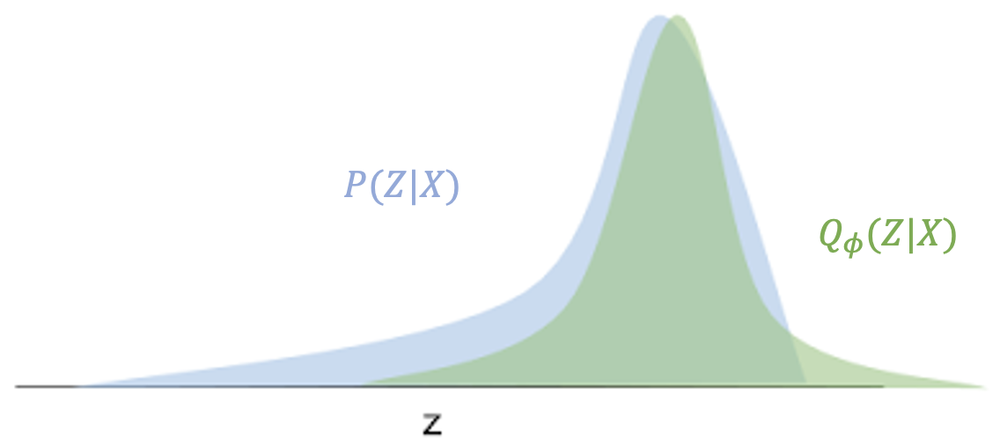
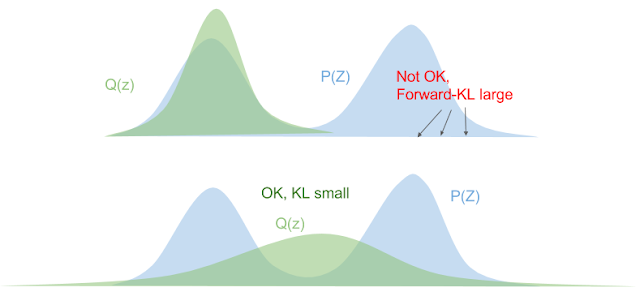
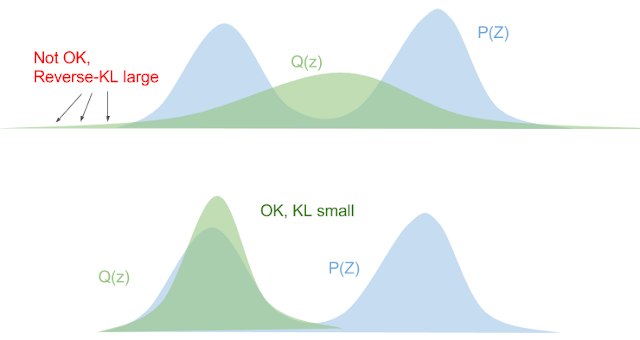

## Background

### Notation
- 大写字母$X$表示随机变量
- 大写$P(X)$表示随机变量的概率分布
- $x\sim P(X)$表示从概率分布中采样出某个值$x$
- 小写$p(X)$表示随机变量$X$的概率密度函数
- $p(X=x)$表示某一点$x$处的概率值

### Bayesian
贝叶斯公式：
$$
p(Z|X)=\frac{p(X|Z)p(Z)}{p(X)}
$$
其中，$p(Z|X)$被称为后验概率(posterior probability)，$p(X|Z)$被称为似然函数(likelihood)，$p(Z)$被称为先验概率(prior probability)，$p(X)$是边缘似然概率。

:::important
$p(x)$被称为边缘似然概率，又称证据（Evidence）,它是指在给定观测数据的情况下，将模型中的某些参数进行边缘化（即对这些参数进行积分或求和）后得到的概率。**这个概率反映了在考虑了所有可能的参数值后，观测数据出现的可能性**。
$$
p(x)=\sum_{z}p(x|z)p(z)
$$
举个例子：
- 想象你要计算“观测到一张图片$x$的概率”，但这张图片可能由无数种潜在原因$z$（如光照、物体形状等）生成。边缘似然$p(x)$是所有这些可能原因下生成$x$的概率之和
- 它衡量了模型对数据$x$的整体解释能力，值越大，说明模型越能解释数据。
:::

### Likelihood
> 定义：The likelihood function (often simply called the likelihood) describes the joint probability of the observed data as a function of the parameters of the chosen statistical model. For each specific parameter value $\theta$  in the parameter space, the likelihood function $p(X | \theta)$ therefore assigns a probabilistic prediction to the observed data $X$.

总结一下上面定义的关键点：
- **似然不是概率**，尽管它看起来像个概率分布，它的加和不是$1$，似然$p(X|Z)$是关于$Z$的函数，是给定$X$变化$Z$的概率
- 一般情况，我们选定似然函数的形式，比如假设$Z$就是高斯分布的$\mu,\sigma$，我们来变换不同的$\mu, \sigma$，得到不同参数分布下得到$X$的概率，换句话说，一般似然函数是可计算的
- **和条件概率的区别**:哪个变量是固定哪个变量是变化的：条件概率$p(X|Z)$中$Z$是固定的，$X$是变化的；似然函数$p(X|Z)$，正相反，$X$是固定的，$Z$是变化的。

### Expecation
离散的随机变量$z$，服从分布$z \sim Q_{\phi}(Z|X)$(注意这个概率分布假定$X$是给定的，$Z$是变化的)。关于随机变量$x$的函数$f(z)$的期望定义：
$$
\mathbb{E}_{z \sim Q_{\phi}(Z|X)}[f(z)]=\sum_{z} q_{\phi}(z|x)\cdot f(z)
$$
其中，$q_{\phi}(z|x)$是取到某个$z$的概率值。另外，$\sum_{z} q_{\phi}(z|x)=1$

:::tip
KL散度在[Loss functions](https://www.s7ev3n.space/posts/loss/losses/#cross-entropy)简单做过定义，其是衡量两个概率分布$P$和$Q$之间差异的非对称度：
$$
D_{KL}(P(X)||Q(X))=\sum_{i=0}^{n}p(x)\log \frac{p(x)}{q(x)}=-\sum_{i=0}^{n}p(x)\log \frac{q(x)}{p(x)}=\mathbb{E}_{x\sim P(X)}[\log\frac{p(x)}{q(x)}]
$$
上面的定义引入的期望，**可知KL散度本身就是关于分布$P(X)$的特定形式的期望**。
:::

## Variational Inference
**变分推断(Variational Inference)是指通过优化方法“近似”后验分布的过程**。

我们都有后验概率的解析式$p(z|x)=\frac{p(x|z)p(z)}{p(x)}$，为什么不能直接计算后验概率而要近似呢？

依次来看似然$p(x|z)$，先验$p(z)$和边缘似然$p(x)$：
- 似然$p(x|z)$: 一般是假设已知似然函数的形式，例如高斯分布
- 先验$p(z)$: 一般也可以估计，例如统计大量数据中猫的图片的数量占比，即为先验
- 边缘似然$p(x)$: 在高维的情况下，计算边缘似然$p(x)$是非常困难的

边缘似然$p(x)$的定义是$p(x)=\sum_{z}p(x|z)p(z)$，如果$z$是高维度向量$z=(z_1,z_2,...,z_n)$，每个维度$z_i$有非常多可能的取值，要遍历所有的$z$，计算$p(x)$是非指数级时间复杂度。

因此，**变分推断通过引入一个参数化的近似分布$q_{\phi}(z)$，通过优化方法是其逼近真实的后验分布$p(z|x)$。**
### Evidence Lower Bound (ELBO)
以下的推导来自这篇博客[^1]。我们定义一个参数化的分布$Q_{\phi}(Z|X)$(假设是高斯分布)，通过调整参数$\phi$来近似$P(Z|X)$，例如下图：

如何“近似”呢？当然是分布间的距离，这里采用了Reverse KL，对离散的$z$（$P(Z|X)$中$X$是观测量固定值，$Z$是随机变量）进行求和:
$$
\begin{align}
KL(Q_\phi(Z|X)||P(Z|X)) = \sum_{z \in Z}{q_\phi(z|x)\log\frac{q_\phi(z|x)}{p(z|x)}}    
\end{align}
$$

> 为什么说是反向Reverse呢？因为我们的目标是$P(Z|X)$，“正向”应该是从$P(Z|X)$看与$Q_\phi(Z|X)$的距离，即$KL(P(Z|X)||Q_\phi(Z|X))$。使用Reverse KL的原因在下节。

对$KL$各种展开推导：
$$
\begin{align} 
KL(Q||P) & = \sum_{z \in Z}{q_\phi(z|x)\log\frac{q_\phi(z|x)p(x)}{p(z,x)}} && \text{via $p(x,z)=p(z|x)p(x)$} \\ 
& = \sum_{z \in Z}{q_\phi(z|x)\big(\log{\frac{q_\phi(z|x)}{p(z,x)}} + \log{p(x)}\big)} \\ 
& = \Big(\sum_{z}{q_\phi(z|x)\log{\frac{q_\phi(z|x)}{p(z,x)}}}\Big) + \Big(\sum_{z}{\log{p(x)}q_\phi(z|x)}\Big) \\ 
& = \Big(\sum_{z}{q_\phi(z|x)\log{\frac{q_\phi(z|x)}{p(z,x)}}}\Big) + \Big(\log{p(x)}\sum_{z}{q_\phi(z|x)}\Big) && \text{via $\sum_{z}{q(z)} = 1 $} \\ 
& = \log{p(x)} + \Big(\sum_{z}{q_\phi(z|x)\log{\frac{q_\phi(z|x)}{p(z,x)}}}\Big)  \\ 
\end{align}
$$

最小化$KL(Q||P)$就是最小化上面公式中的第二项，因为$\log{p(x)}$是固定的。然后我们把第二项展开(引入了[期望](#expecation)的定义)：
$$
\begin{align} 
\sum_{z}{q_\phi(z|x)\log{\frac{q_\phi(z|x)}{p(z,x)}}} & = \mathbb{E}_{z \sim Q_\phi(Z|X)}\big[\log{\frac{q_\phi(z|x)}{p(z,x)}}\big]\\ 
& = \mathbb{E}_Q\big[ \log{q_\phi(z|x)} - \log{p(x,z)} \big] \\ 
& = \mathbb{E}_Q\big[ \log{q_\phi(z|x)} - (\log{p(x|z)} + \log(p(z))) \big] && \text{(via  $\log{p(x,z)=p(x|z)p(z)}$) }\\ 
& = \mathbb{E}_Q\big[ \log{q_\phi(z|x)} - \log{p(x|z)} - \log(p(z))) \big] \\ 
\end{align} \\
$$
最小化上面，就是最大化它的负数：
$$
\begin{align} 
\text{maximize } \mathcal{L} & = -\sum_{z}{q_\phi(z|x)\log{\frac{q_\phi(z|x)}{p(z,x)}}} \\ 
& = \mathbb{E}_Q\big[ -\log{q_\phi(z|x)} + \log{p(x|z)} + \log(p(z))) \big] \\ 
& =  \mathbb{E}_Q\big[ \log{p(x|z)} + \log{\frac{p(z)}{ q_\phi(z|x)}} \big] && \\ 
\end{align}
$$

上面公式还可以进一步推导变得更直观：
$$
\begin{align*} 
\mathcal{L} & =  \mathbb{E}_Q\big[ \log{p(x|z)} + \log{\frac{p(z)}{ q_\phi(z|x)}} \big] \\ 
& =   \mathbb{E}_Q\big[ \log{p(x|z)} \big] + \sum_{Q}{q(z|x)\log{\frac{p(z)}{ q_\phi(z|x)}}} && \text{Definition of expectation} \\ 
& =  \mathbb{E}_Q\big[ \log{p(x|z)} \big] - KL(Q(Z|X)||P(Z)) && \text{Definition of KL divergence} && 
\end{align*}
$$

在VAE中，从$z \sim Q(Z|X)$采样是所谓的Encoding过程，即将样本$X$压缩到隐变量$z$，从$x \sim Q(X|Z)$中采样是Decoding过程，即生成或恢复样本$x$。

从上面公式可知，$\mathcal{L}$是两部分的加和，第一部份是decoding的似然函数的期望，即衡量变分分布可以从隐变量$Z$从解码回到$X$的好坏，第二部分是我们用于逼近真实分布的变分分布$Q(Z|X)$于隐变量的先验$P(Z)$的KL散度。如果我们假定$Q(Z|X)$的形式是条件概率高斯分布，那么先验$P(Z)$经常选取的是标准高斯分布，即均值为$\mathbb{0}$和方差是$\mathbb{1}$。

带入初始的公式$(1)$，会得到：
$$
KL(Q||P)=\log{p(x)}-\mathcal{L}
$$
由于$KL(Q||P) \geq 0$，所以必然有$\log{p(x)} \geq \mathcal{L}$，$\mathcal{L}$就被称为变分下界(variational lower bound)，或Evidence Lower Bound (ELBO)，我们需要知道到底是针对什么的下界，它是$\log p(x)=\log \sum_{z}p(x|z)p(z)$，即模型生成观测$x$的能力。

回到变分推断的优化目标，如果要最小化$KL(Q||P)$，即要最小化$-\mathcal{L}$，因此损失函数是:
$$
Loss=-\mathcal{L}= -\mathbb{E}_Q\big[ \log{p(x|z)} \big] + KL(Q(Z|X)||P(Z))
$$

[^1]: [A Beginner's Guide to Variational Methods: Mean-Field Approximation](https://blog.evjang.com/2016/08/variational-bayes.html)

### Forward KL vs. Reverse KL
前面说过，在使用变分分布$Q(Z|X)$来逼近真实后验分布$P(Z|X)$时，我们使用的是Reverse KL，即$KL(Q||P)$。原因是什么呢？

如果选择Forward KL:
$$
KL_{fwd}(P||Q)=\mathbb{E}_{z \sim P}[\log{\frac{p(z)}{q(z)}}]
$$
我们不必展开过多，上面公式中已经有困难存在：$z$需要从真实后验$P(Z|X)$中采样，这是不可能的，因为真实后验我们不知道。
除了上面的困难，还有**优化不稳定的问题**。

上面公式中$\frac{p(z)}{q(z)}$，如果真实后验$p(z)>0$，但是变分分布$q(z)$比如说接近$0$，会导致$\frac{p(z)}{q(z)}$的值变得无穷大，即$q(z)$需要支撑(support)$p(z)$区域，否则优化就爆炸了，这会导致变分分布$q(z)$在优化过程中避免$0$出现(zero-avoiding)，见下图：

那Reverse KL是什么情况呢？
$$
KL_{rev}(Q||P)=\mathbb{E}_{z \sim Q}[\log{\frac{q(z)}{p(z)}}]
$$
当真实后验$p(z)$趋近于$0$，变分分布$q(z)$也会趋近于$0$，见下图：

总结起来，**最小化forward-KL会拉伸变分分布$p(z)$来覆盖掉整个真实后验$p(z)$，而最小化Reverse KL会使得变分分布$p(z)$更挤进真实后验$p(z)$**。

## Variational Autoencoder
铺垫了很多终于要来到变分自编码器VAE了。Lil'Log的文章[^2]比较了多种Autoencoder，同时也包含VAE，建议去认真阅读。

自编码器一般由两部分构成：编码器和解码器。解码器负责将高维数据压缩到一个隐变量(latent code)，相当于对高维数据的降维；解码器负责从隐变量恢复出输入的高维数据数据，注意是恢复，而不是生成。但是，VAE和AE相比非常不一样，VAE是一个“**生成式**”模型。VAE的编码器将高维数据压缩到一个**隐空间的分布**中，从分布中采样，解码器负责从新的采样中恢复(生成)和输入数据不同的数据！
我们设输入数据为$X$，隐变量为$Z$，隐变量$Z$所在的分布使用$P(Z)$来表示，**生成模型的核心任务是学习数据的分布$P(X)$**，从而能够生成与真实数据分布一致的新样本$X_{new}$，但是直接建模高维数据$X$的分布十分困难，原因在于高维数据计算复杂，以及数据$X$中隐含的潜在变量（如物体的形状、光照条件）未被显式建模。解决方案是引入隐变量$Z$，通过隐变量控制生成：$P(X|Z)P(Z)$，具体来说：

- 概率编码器$P(Z|X)$把输入$X=x$压缩到隐空间的分布$P(Z)$
- 从隐空间$P_{\theta}(Z)$中采样新隐变量$z_{new}$
- 概率解码器$P(X|Z)$基于隐变量$z_{new}$生成$x_{new}$

即：
$$
x_{new} \sim P(X) = \sum p(x|z)p(z)dz
$$

> 为什么是对$z$的求和(积分)？通过对$Z$求和(积分)，模型生成的$X$不再依赖于某个特定的$Z$，而是覆盖所有可能的$Z$值，从而匹配真实数据分布$P(X)$。

上面公式，和前面的[边缘似然](#bayesian)的定义是一致的，并且在[变分方法](#variational-inference)的推导中，我们知道$\log{p(X)}\geq ELBO$，即我们需要最小化$-ELBO$:
$$
\mathcal{L}_{VAE}=
 - \mathbb{E}_{\mathbf{z} \sim q_\phi(\mathbf{z}\vert\mathbf{x})} \log p_\theta(\mathbf{x}\vert\mathbf{z}) + D_\text{KL}( q_\phi(\mathbf{z}\vert\mathbf{x}) \| p_\theta(\mathbf{z}) ) 
$$

[^2]: [From Autoencoder to Beta-VAE](https://lilianweng.github.io/posts/2018-08-12-vae/)

### Reparameterization Trick
上面的损失函数放到深度学习的语境下存在一个问题，采样过程$\mathbf{z} \sim q_\phi(\mathbf{z}\vert\mathbf{x})$是一个随机过程，不可微，没有办法使用反向传播来更新梯度。于是，引入一个技巧，称为重参数化技巧。
:::important
重参数化技巧通过将随机性转移到基础噪声变量，使梯度能够通过确定性路径传播，解决了深度生成模型中随机采样导致的梯度不可导问题。将采样过程改写为以下形式：
$$
z = g_{\theta}(\epsilon), \epsilon \sim p(\epsilon)
$$
其中，
- $\epsilon$是一个与模型参数无关的基础随机变量（如标准高斯噪声$\epsilon \sim \mathcal{N}(0,1)$）
- $g_{\theta}(\epsilon)$是一个**确定性**函数，将$\epsilon$转变为$z$，函数$g$的参数为$\theta$
:::

VAE中假设$q_\phi(\mathbf{z}\vert\mathbf{x})$的形式是多元高斯分布
$$
\mathbf{z} \sim q_\phi(\mathbf{z}\vert\mathbf{x}) = \mathcal{N}(\boldsymbol{\mu}, \boldsymbol{\sigma}\boldsymbol{I})
$$

经过$g_{\theta}(\epsilon)$重参数化之后：
$$
\mathbf{z} = \boldsymbol{\mu} + \boldsymbol{\sigma} \odot \boldsymbol{\epsilon} \text{, where } \boldsymbol{\epsilon} \sim \mathcal{N}(0, \boldsymbol{I})  \scriptstyle{\text{; Reparameterization trick.}}
$$
其中$\odot$意味着元素相乘。

如此，梯度变得可计算：
$$
\begin{align*}
    \frac{\partial \mathcal{L}}{\partial \mu} &= \mathbb{E}_{\epsilon \sim \mathcal{N}(0,1)} \left[ \frac{\partial \mathcal{L}}{\partial z} \cdot \frac{\partial z}{\partial \mu} \right] = \mathbb{E}_{\epsilon} \left[ \frac{\partial \mathcal{L}}{\partial z} \cdot 1 \right] \\
    \frac{\partial \mathcal{L}}{\partial \sigma} &= \mathbb{E}_{\epsilon \sim \mathcal{N}(0,1)} \left[ \frac{\partial \mathcal{L}}{\partial z} \cdot \frac{\partial z}{\partial \sigma} \right] = \mathbb{E}_{\epsilon} \left[ \frac{\partial \mathcal{L}}{\partial z} \cdot \epsilon \right]
\end{align*}
$$

最后，使用博客[^2]中的图更直观的表示VAE：
